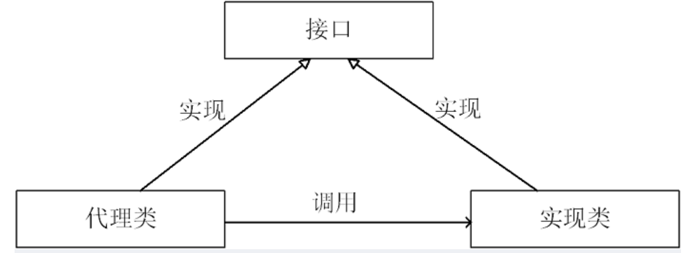

## Unsafe

### 知识点

- Unsafe提供了非常底层的方法，包括操作内存，线程调度、CAS、系统、内存屏障、对象操作、Class

- 使Java拥有了类似c语言一样的指针，所以不安全

- LookSupport中的unpark也是调用的unsafe的方法

- Unsafe不能直接调用

  - 通过反射获得

    - ```java
      Field theUnsafe = Unsafe.class.getDeclaredField("theUnsafe");
      theUnsafe.setAccessible(true);
      Unsafe unsafe = theUnsafe.get(null);
      ```

  - Unsafe提供了一个静态方法getUnsafe可以获取Unsafe实例，但是必须使用引导类加载器加载Unsafe类才能使用

    - 命令行中输入：`java -Xbootclasspath/a: ${path}   // 其中path为调用Unsafe相关方法的类所在jar包路径 `


### 操作

- 操作内存
  - 主要包含堆外内存的分配、拷贝、释放、给定地址值操作等方法
  - 为什么要使用堆外内存
    - 对垃圾回收停顿的改善。由于堆外内存是直接受操作系统管理而不是JVM，所以当我们使用堆外内存时，即可保持较小的堆内内存规模。从而在GC时减少回收停顿对于应用的影响。
    - 提升程序I/O操作的性能。通常在I/O通信过程中，会存在堆内内存到堆外内存的数据拷贝操作，对于需要频繁进行内存间数据拷贝且生命周期较短的暂存数据，都建议存储到堆外内存。
  - 应用：
    - DirectByteBuffer
      - 在NIO框架中通常作为缓冲池使用，内部的内存分配逻辑都由Unsafe提供
      - `base = unsafe.allocateMemory(内存大小)` ：分配内存，返回基地址
      - `unsafe.setMemory(base, size, (byte) 0)` ：设置内存，内存初始化
      - `cleaner = Cleaner.create(this, new Deallocator(base, size, cap))` ：跟踪DirectByteBuffer对象的垃圾回收，以实现当DirectByteBuffer被垃圾回收时，分配的堆外内存一起被释放
        - Cleaner继承自虚引用，当DirectByteBuffer对象仅被Cleaner对象引用时，gc时会将DirectByteBuffer对象回收，Cleaner对象会调用clean() 方法来进行堆外内存的释放。
- CAS
  - AtomicInteger 使用 unsafe提供的CAS
  - Unsafe只提供了 compareAndSwapObject、compareAndSwapInt、compareAndSwapLong 方法
  - 赋值阶段源码中都是通过do-while判断（通过反编译查看源码）
  - 这些方法都是在unsafe.cpp中有具体的实现
    - 如果是多处理器，需要添加lock前缀（Lock#信号），内存屏障
    - 这里的lock前缀就是使用了处理器的**总线锁**(最新的处理器都使用**缓存锁**代替总线锁来提高性能)
      - 总线锁：将cpu和内存之间的通信锁住，其他cpu不能操作内存中的数据，开销比较大
      - 缓存锁：使用**缓存锁定**，将原子操作放在cpu缓存中进行
        - 缓存锁定：发生共享内存的锁定时，不会锁内存，而是修改内存地址，通过**缓存一致性**保证原子性
        - 缓存一致性：
          - 如果这块内存被两个以上的处理器缓存，会阻止这块内存区域的同时修改
          - 当处理器对缓存中的数据修改后，会通知其他处理器删除其内部这块内存的缓存，或者从主内存中重新读取
        - 如果操作的数据跨多个缓存行时，处理器会使用总线锁
- 线程调度
  - 线程挂起、恢复、锁机制
  - park、unpark、monitorEnter、monitorExit、tryMonitorEnter
- Class相关
  - 提供Class和它的静态字段的操作相关方法，包含静态字段内存定位、定义类、定义匿名类、检验&确保初始化等
  - 获取属性在内存中的位置
  - 获取数组第一个元素在内存中的偏移地址，还可以获取下标的增量地址
- 系统相关
  - addressSize：返回系统指针的大小。返回值为4（32位系统）或 8（64位系统）
  - pageSize：内存页的大小，此值为2的幂次方
- 内存屏障
  - loadFence：禁止load操作重排序
  - storeFence：禁止store操作重排序
  - fullFence：禁止load、store操作重排序
- 对象操作
  - 主要包含对象成员属性相关操作及非常规的对象实例化方式等相关方法
  - Unsafe的allocateInstance实现对象的实例化，保证在目标类无默认构造函数时，反序列化不够影响

## 函数式接口

### 	Runnabl

### Comparator

### Supplier\<T>		

- 作用：返回一个指定类型的数据（生产型接口）

- 方法：T get()

### Consumer\<T>		

- 作用：用于消费数据（消费型接口）

- 方法

  - accept(T t)

  - andThen()			可以把俩个Consumer接口组合在一起
    - consumer1.andThen(consumer2).accept()			
      - consumer1会先执行


### Predicate\<T>

- 作用：对数据进行判断

- 方法：

  - test(T t)
    - 返回值是Boolean


  - and()		与
    - `pre1.and(pre2).test(str);					//都为真返回true`


  - or()			或
    - `pre1.or(pre2).test(str);					//一个为真返回true`


  - negate()		取反
    - `pre.negate().test(str)						//真为假，假为真`


### Function<T,R>

- 作用：将一个类型的数据转换为另一个类型的数据

- 方法

  - R apply(T t)		把数据类型T转换为R类型

  - andThen			 将俩个function接口进行组合操作 

    - ```java
      //放回值取决于第二个接口的放回值类型
      public static String method2(String s, Function<String,Integer> fun1,Function<Integer,String> fun2){
              return fun1.andThen(fun2).apply(s);
      }
      ```


## Stream流

### 思想

​	关注的是做什么，而不是怎么做，相当于流水线，只能使用一次 

### 获取流的方法

​	1.Collection集合都可以调用默认方法Stream()来获取流

```java
//list转Stream	List\<T>
Stream\<T> stream = list.stream();
//set转Stream	Set\<T>
Stream\<T> stream = set.stream();
//map转Stream	Map<T,R>
Stream\<T> stream = map.keySet().stream();
Stream<R> stream = map.values().stream();
Stream<Map.Entry<T, R>> stream = map.entrySet().stream();
```

​	2.Stream接口的静态方法of()可以获取对应的流

```java
//数组转Stream
Stream.of(数组)
```

### 常用方法

#### reduce() 

- 实现聚合计算，求和等等
- Identity : 定义一个元素代表是归并操作的初始值，如果Stream 是空的，也是Stream 的默认结果
- Accumulator: 定义一个带两个参数的函数，第一个参数是上个归并函数的返回值，第二个是Strem 中下一个元素。
- Combiner: 调用一个函数来组合归并操作的结果，当归并是并行执行或者当累加器的函数和累加器的实现类型不匹配时才会调用此函数。

#### mapToXXX()

- 映射为对应的类型，有Int、Long、Double
- 后可接求大小、平均值、求和等等

#### orElse / orElseGet

- orElse(null)表示如果一个都没找到返回null。【orElse()中可以塞默认值。如果找不到就会返回orElse中你自己设置的默认值。】
- orElseGet(null)表示如果一个都没找到返回null。【orElseGet()中可以塞默认值。如果找不到就会返回orElseGet中你自己设置的默认值。】
- 区别就是在使用方法时，即使没有值，也会执行 orElse 内的方法， 而 orElseGet则不会

## 动态代理



​	实现类又称被代理类

### 实现

 - 创建动态代理类

```java
//代理工厂类
class ProxyFactory {
	//传入实现类(被代理类)对象，返回代理类对象
    //Object obj 被代理类对象
    public static Object getProxyInstance(Object obj){
    	//创建InvocationHandler实现类对象
        MyInvocationHandler handler = new MyInvocationHandler(obj);
        //返回代理类对象
        //obj.getClass().getClassLoader()获取被代理类的类加载器
        //obj.getClass().getInterfaces() 获取被代理类实现的接口
        return Proxy.newProxyInstance(obj.getClass().getClassLoader(),
        obj.getClass().getInterfaces(),handler);
    }

}
//InvocationHandler实现类
class MyInvocationHandler implements InvocationHandler{
	//被代理类对象
    private Object obj;
    //获取被代理类对象
    MyInvocationHandler(Object obj){
        this.obj = obj;
    }
    @Override
    public Object invoke(Object proxy, Method method, Object[] args) throws Throwable {
        return method.invoke(obj,args);
    }
}
```

---

## API

### Runtime

- 概述

  - 封装了运行的环境，每个Java应用程序都有一个Runtime实例
  - 一般不能实例化Rumtime对象，可以通过getRuntime()获取当前对象的引用
  - 拥有一个静态初始化对象--饿汉模式(单例模式的一种)
    - `private static Runtime currentRuntime = new Runtime();`

  - 常用方法

    - availableProcessors()								返回当前可用的虚拟机数量

    - exec()                                                    执行其他程序，例如打开记事本

      - `r.exec("notepad")`

    - 内存管理

      - totalMemory())						返回当前对象的堆内存有多大

      - freeMemory()                      返回当前对象的堆内存还剩多少

      - gc()                                      根据需要运行无用单元收集器先于

        ​														虚拟机自动回收对象

### Process

### Optional

- 为了防止空指针异常

#### 方法

- Optional.of(T t)
  - t不能为null
- Optional.empty()
  - 创建一个空的Optional实例
- Optional.ofNullable(T t)
  - t可以为空
- Optional对象.orElse(T t)
  - Optional对象为空则返回t

## 其他

### rt.jar、dt.jar、tools.jar

- rt.jar
  - 代表runtime JAR，包含Core Java API的所有类，包含所有核心Java 运行环境的已编译calss文件
  - 位于JRE的lib目录下，包含了JVM信任的class文件，JVM加载时不会对其他class文件进行严格的安全检查
  - 是一个类似zip的压缩文件，精确称为 Java archive（Jar），存储了Java class文件和程序所需的全部资源。它还可以包含==mainfest==文件，还可以包含==Main-Class条目==，变成可执行JAR
- dt.jar
  - 是系统用来编译一个类的时候用到的，即执行javac的时候用到。
- tools.jar
  - dt.jar是关于运行环境的类库，主要是swing包。
