# MyBatis

## 使用

- 添加MyBatis的依赖

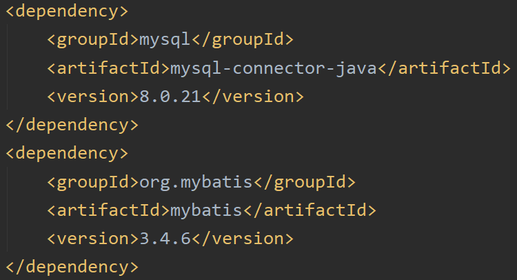

- 创建user数据表

- 编写User实体类

- 创建UserMapper.xml

  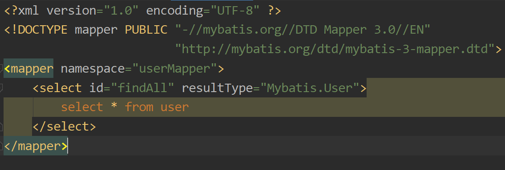

- 创建mybatis.xml

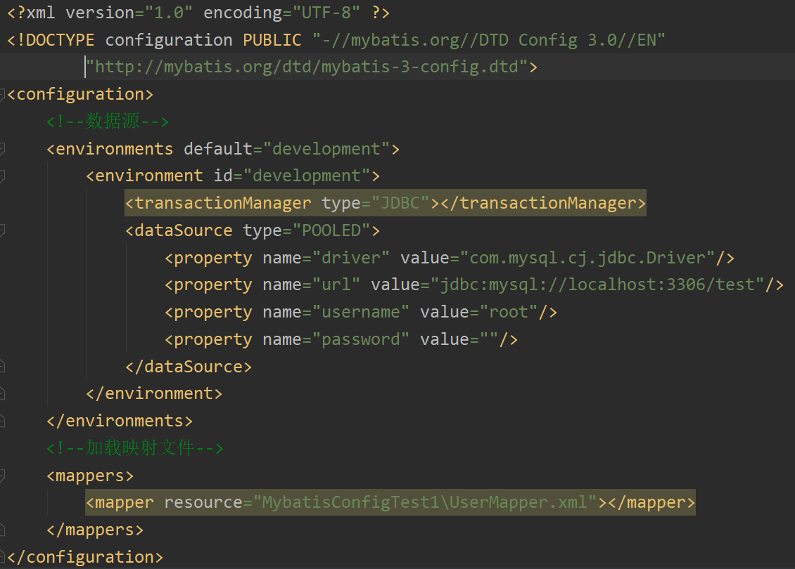

- 测试

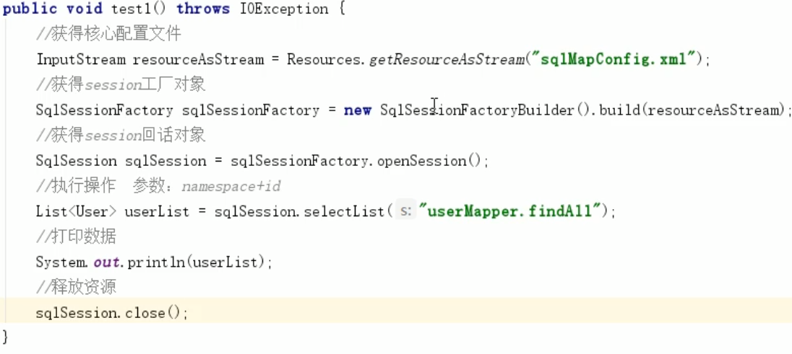

## 增删改

### 增

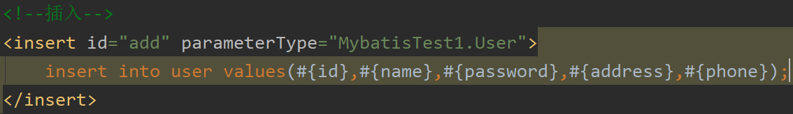

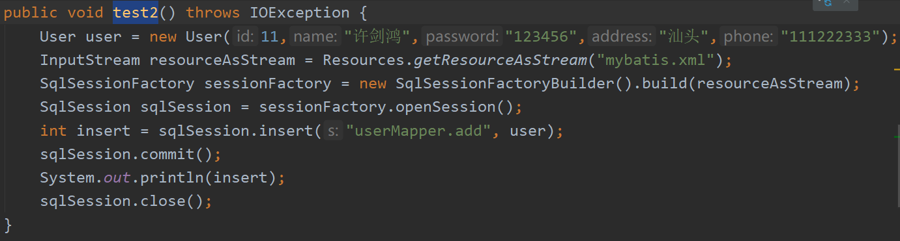

### 删

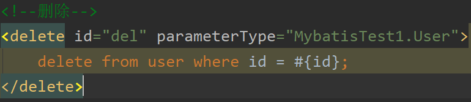

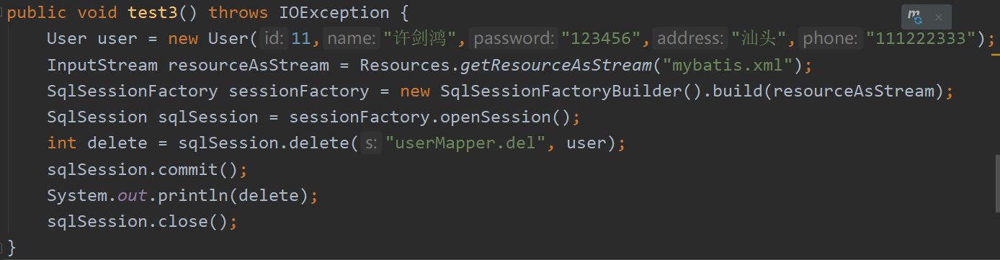

### 改

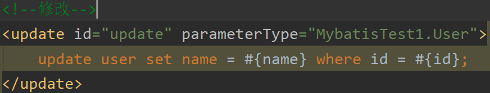

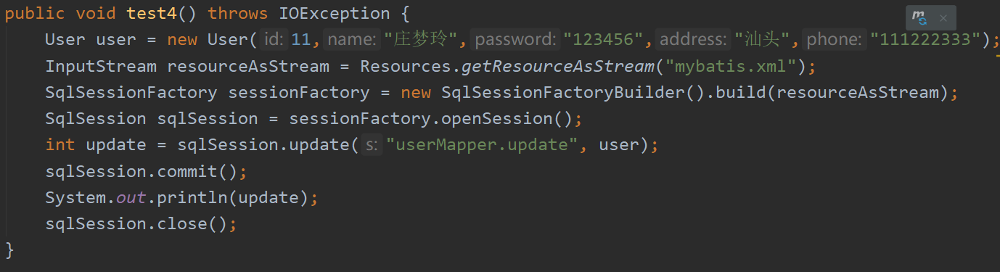

## 配置文件

- environments
  - transactionManager
    - JDBC
    - MANAGED
  - dataSource
    - UNPOOLED
    - POOLED
    - JNDI
- Mapper
- Properties
  - 开发中习惯将数据源的配置信息抽取出来

- typeAliases 
  - 起别名

## API

- SqlSessionFactoryBuilder
  - 用 build() 方法构建一个SqlSessionFactory对象
  - SqlSessionFactory常用的创建SqlSession实例的方法有以下两个
    - openSession()
      - 会默认开启一个事务，但事务不会自动提交，需要手动提交
    - openSession(boolean autoCommit)
      - 参数为是否自动提交
- SqlSession
  - 增删改查

## Dao层实现

- 代理开发实现
  - 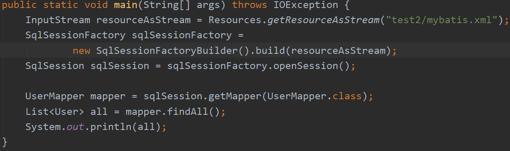
  - 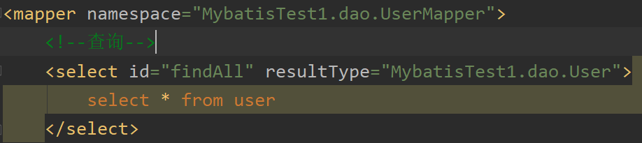
  - 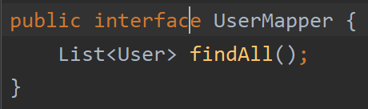
    - UserMapper.xml 中的命名空间需要是接口的全路径
    - 方法id需要和接口方法名一致
    - 放回值和参数也需要一致

## 返回值中有集合

## 映射文件深入

### 动态Sql

- if

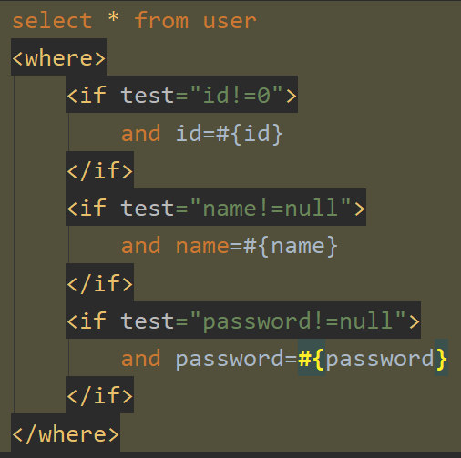

- foreach
  - 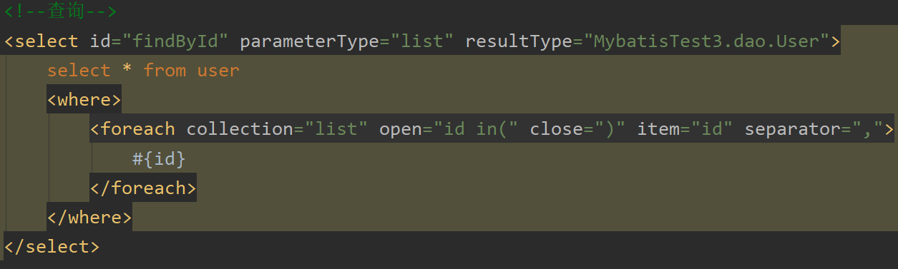

### Sql语句抽取

- ```xml
  <sql id="">常用sql语句</sql>	
  ```

## 配置文件深入

### TypeHandlers\<T>

- T是想要转换的类型

- 自定义类型转换器
  - 继承BaseTypeHandler，实现四个方法
    - setNonNullParameter()
      - 将Java类型转换成数据库需要的类型
    - getNullableResult()
      - 有三个重载
      - 将数据库中的数据转换成Java类型

### Plugins

#### PageHelper

- 导入依赖

  - 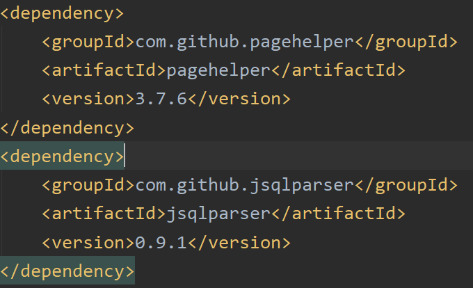

- 配置

  - 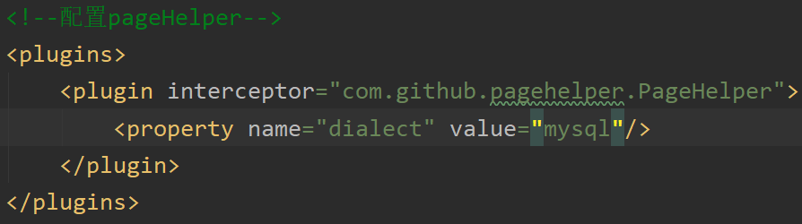

- 使用

  - 显示数据

    - ```java
      PageHelper.startPage(第几页,一页几条数据);
      ```

  - 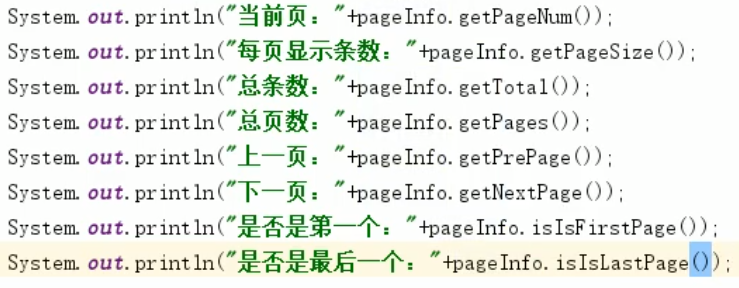

## 多表操作

### 一对一

将查询的结果和实体中的元素一一对应

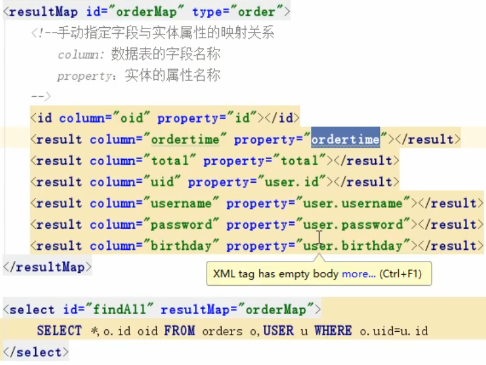

另一种写法

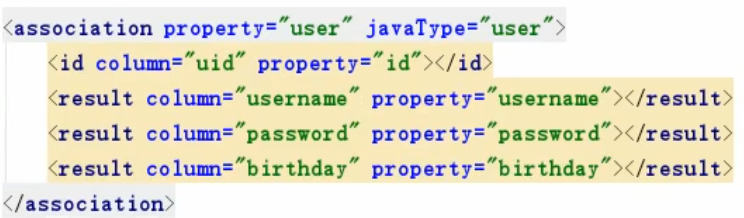

### 一对多

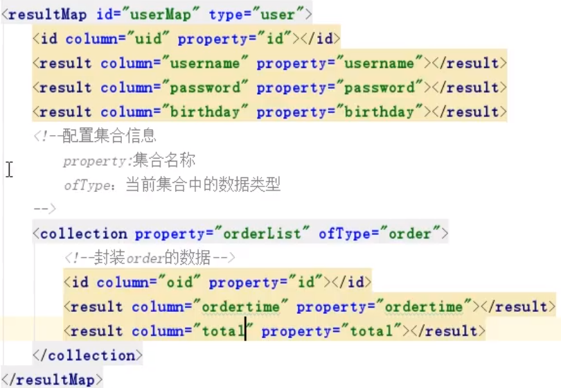

### 多对多

​	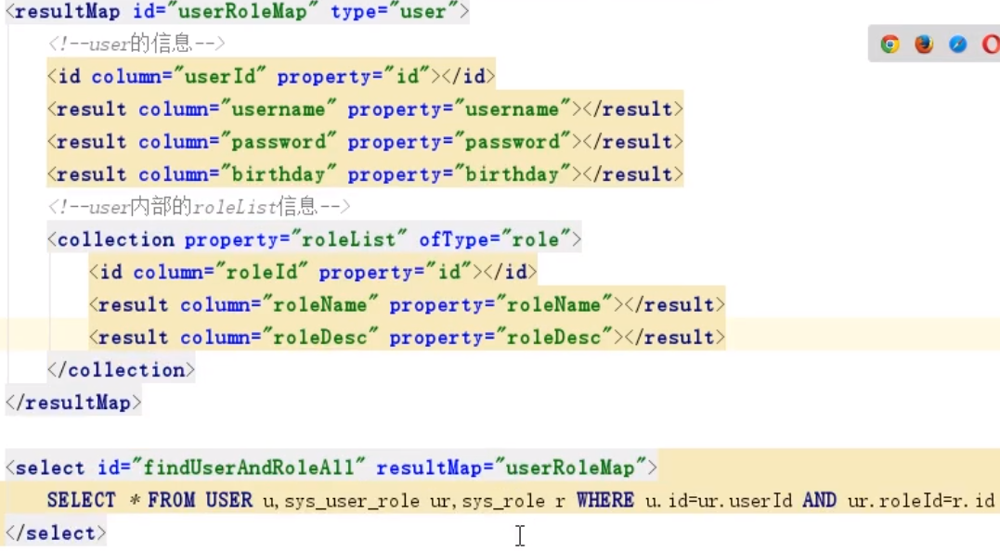

## 注解开发

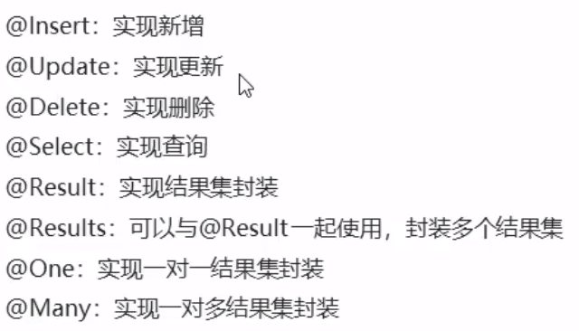

### 步骤

- 在接口上写注解，在注解中写sql语句
- 在mybatis.xml 中配置映射关系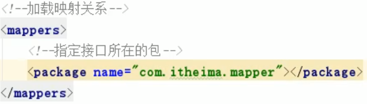

### 一对一

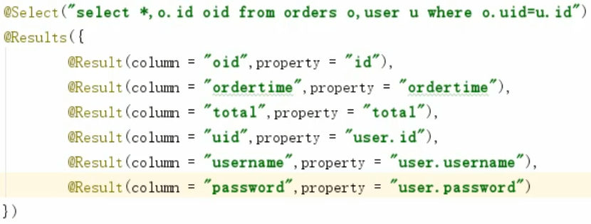

方式二

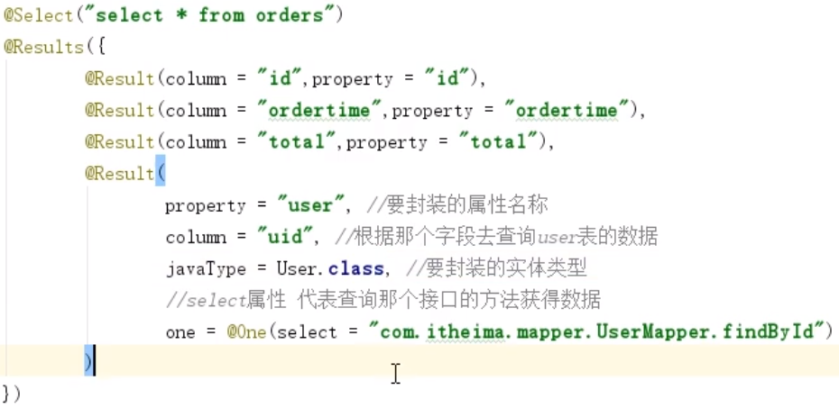

### 一对多

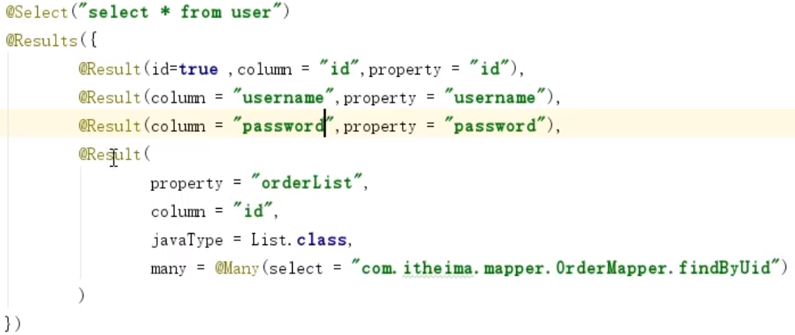

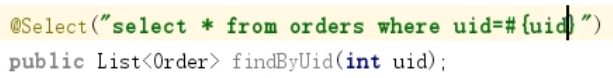

### 多对多

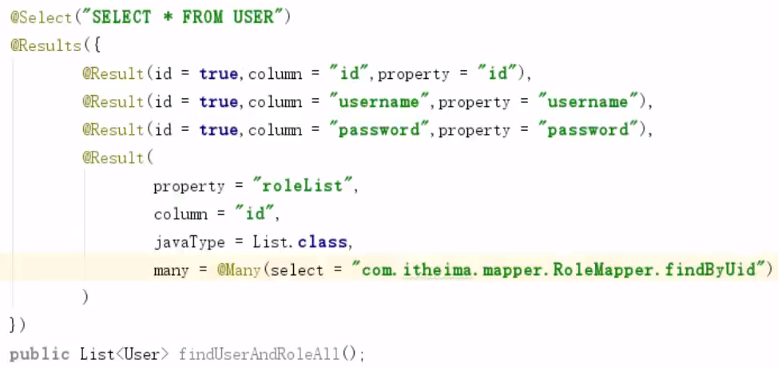

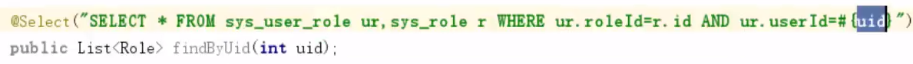

# MyBatisPlus

## 使用步骤

1. 引入依赖

```xml
<!-- mybatis-plus -->
<dependency>
    <groupId>com.baomidou</groupId>
    <artifactId>mybatis-plus-boot-starter</artifactId>
    <version>3.3.1</version>
</dependency>
<!-- mybatis-plus代码生成器 -->
<dependency>
    <groupId>com.baomidou</groupId>
    <artifactId>mybatis-plus-generator</artifactId>
    <version>3.3.1.tmp</version>
</dependency>
<!-- mybatisPlus Freemarker 模版引擎 -->
<dependency>
    <groupId>org.freemarker</groupId>
    <artifactId>freemarker</artifactId>
</dependency>
<!-- freemarker 作为 MyBatis-Plus 自动生成代码时作为模板使用，还可选用 velocity 作为模板 -->
<dependency>
    <groupId>org.apache.velocity</groupId>
    <artifactId>velocity-engine-core</artifactId>
    <version>2.2</version>
</dependency>
```

2. 配置信息

```yaml
# mybatis配置
mybatis-plus:
  # xml文件路径
  mapper-locations: classpath:mapper/*.xml
  # 实体类路径
  type-aliases-package: com.xjh.entity
  configuration:
    # 驼峰转换
    map-underscore-to-camel-case: true
    # 是否开启缓存
    cache-enabled: false
    # 打印sql
    log-impl: org.apache.ibatis.logging.stdout.StdOutImpl
  # 全局配置
  global-config:
    # 数据库字段驼峰下划线转换
    db-column-underline: true
    # id自增类型(数据库id自增)
    id-type: 0
    	# 0 为数据库自增id
    	# 1 为不设置自增id
    	# 2 为用户输入id
    	# 3 为当插入对象为空时自动填充id
    	# 4 为分配字符串型的UUID
```

- MyBatis-Plus 默认的id生成算法是 雪花算法 ，缺点是比较长

3. 配置启动类

```java
@MapperScan("")
@ComponentScan(basepackages = {""})
public void 启动类(){
    
}
```

## 代码生成器

### 一

```java
public class CodeGenerator {
    /**
     * <p>
     * 读取控制台内容
     * </p>
     */
    public static String scanner(String tip) {
        Scanner scanner = new Scanner(System.in);
        StringBuilder help = new StringBuilder();
        help.append("请输入" + tip + "：");
        System.out.println(help.toString());
        if (scanner.hasNext()) {
            String ipt = scanner.next();
            if (StringUtils.isNotEmpty(ipt)) {
                return ipt;
            }
        }
        throw new MybatisPlusException("请输入正确的" + tip + "！");
    }

    /**
     * 自动生成代码
     */
    public static void main(String[] args) {
        // 代码生成器
        AutoGenerator mpg = new AutoGenerator();
        // TODO 全局配置
        GlobalConfig gc = new GlobalConfig();
        String projectPath = System.getProperty("user.dir");
        // 生成文件的输出目录【默认 D 盘根目录】
        gc.setOutputDir(projectPath + "/src/main/java");
        // 作者
        gc.setAuthor("lizhou");
        // 是否打开输出目录
        gc.setOpen(false);
        // controller 命名方式，注意 %s 会自动填充表实体属性
        gc.setControllerName("%sController");
        // service 命名方式
        gc.setServiceName("%sService");
        // serviceImpl 命名方式
        gc.setServiceImplName("%sServiceImpl");
        // mapper 命名方式
        gc.setMapperName("%sMapper");
        // xml 命名方式
        gc.setXmlName("%sMapper");
        // 开启 swagger2 模式
        gc.setSwagger2(true);
        // 是否覆盖已有文件
        gc.setFileOverride(true);
        // 是否开启 ActiveRecord 模式
        gc.setActiveRecord(true);
        // 是否在xml中添加二级缓存配置
        gc.setEnableCache(false);
        // 是否开启 BaseResultMap
        gc.setBaseResultMap(true);
        // XML columList
        gc.setBaseColumnList(false);
        // 全局 相关配置
        mpg.setGlobalConfig(gc);

        // TODO 数据源配置
        DataSourceConfig dsc = new DataSourceConfig();
        dsc.setUrl("jdbc:mysql://127.0.0.1:3306/sbm?useUnicode=true&useJDBCCompliantTimezoneShift=true&useLegacyDatetimeCode=false&serverTimezone=UTC&useSSL=true&characterEncoding=UTF-8");
        dsc.setDriverName("com.mysql.jdbc.Driver");
        dsc.setUsername("root");
        dsc.setPassword("123456");
        mpg.setDataSource(dsc);

        // TODO 包配置
        PackageConfig pc = new PackageConfig();
        // 父包名。如果为空，将下面子包名必须写全部， 否则就只需写子包名
        pc.setParent("com.zyxx.sbm");
        // Entity包名
        pc.setEntity("entity");
        // Service包名
        pc.setService("service");
        // Service Impl包名
        pc.setServiceImpl("service.impl");
        mpg.setPackageInfo(pc);

        // TODO 自定义配置
        InjectionConfig cfg = new InjectionConfig() {
            @Override
            public void initMap() {
                // to do nothing
            }
        };
        // 输出文件配置
        List<FileOutConfig> focList = new ArrayList<>();
        focList.add(new FileOutConfig("/templates/mapper.xml.ftl") {
            @Override
            public String outputFile(TableInfo tableInfo) {
                // 自定义输入文件名称
                return projectPath + "/src/main/resources/mapper/" + tableInfo.getEntityName() + "Mapper.xml";
            }
        });
        // 自定义输出文件
        cfg.setFileOutConfigList(focList);
        mpg.setCfg(cfg);
        mpg.setTemplate(new TemplateConfig().setXml(null));

        // TODO 策略配置
        StrategyConfig strategy = new StrategyConfig();
        // 数据库表映射到实体的命名策略，驼峰原则
        strategy.setNaming(NamingStrategy.underline_to_camel);
        // 字数据库表字段映射到实体的命名策略，驼峰原则
        strategy.setColumnNaming(NamingStrategy.underline_to_camel);
        // 实体是否生成 serialVersionUID
        strategy.setEntitySerialVersionUID(false);
        // 是否生成实体时，生成字段注解
        strategy.setEntityTableFieldAnnotationEnable(true);
        // 使用lombok
        strategy.setEntityLombokModel(true);
        // 设置逻辑删除键
        strategy.setLogicDeleteFieldName("del_flag");
        // TODO 指定生成的bean的数据库表名
        strategy.setInclude(scanner("表名，多个英文逗号分割").split(","));
        // 驼峰转连字符
        strategy.setControllerMappingHyphenStyle(true);
        mpg.setStrategy(strategy);
        // 选择 freemarker 引擎需要指定如下加，注意 pom 依赖必须有！
        mpg.setTemplateEngine(new FreemarkerTemplateEngine());
        mpg.execute();
    }
}
```

- 使用 MyBatisPlus 提供的 SqlSessionFactoryBuilder 去创建sqlSession实例
- mapper 类继承 BaseMapper 类

### 二

```java
public void genCode() {

    // 1、创建代码生成器
    AutoGenerator mpg = new AutoGenerator();

    // 2、全局配置
    GlobalConfig gc = new GlobalConfig();
    String projectPath = System.getProperty("user.dir");
    gc.setOutputDir(projectPath + "/src/main/java");
    gc.setAuthor("jianhong.xu");
    gc.setOpen(false); //生成后是否打开资源管理器
    gc.setServiceName("%sService");	//去掉Service接口的首字母I
    gc.setIdType(IdType.AUTO); //主键策略
    gc.setSwagger2(true);//开启Swagger2模式
    mpg.setGlobalConfig(gc);

    // 3、数据源配置
    DataSourceConfig dsc = new DataSourceConfig();
    dsc.setUrl("jdbc:mysql://localhost:3306/loan?serverTimezone=GMT%2B8&characterEncoding=utf-8");
    dsc.setDriverName("com.mysql.cj.jdbc.Driver");
    dsc.setUsername("root");
    dsc.setPassword("123456");
    dsc.setDbType(DbType.MYSQL);
    mpg.setDataSource(dsc);

    // 4、包配置
    PackageConfig pc = new PackageConfig();
    pc.setParent("xu.srb.core");
    pc.setEntity("pojo.entity"); //此对象与数据库表结构一一对应，通过 DAO 层向上传输数据源对象。
    mpg.setPackageInfo(pc);

    // 5、策略配置
    StrategyConfig strategy = new StrategyConfig();
    strategy.setNaming(NamingStrategy.underline_to_camel);//数据库表映射到实体的命名策略
    strategy.setColumnNaming(NamingStrategy.underline_to_camel);//数据库表字段映射到实体的命名策略
    strategy.setEntityLombokModel(true); // lombok
    strategy.setLogicDeleteFieldName("is_deleted");//逻辑删除字段名
    strategy.setEntityBooleanColumnRemoveIsPrefix(true);//去掉布尔值的is_前缀（确保tinyint(1)）
    strategy.setRestControllerStyle(true); //restful api风格控制器 返回json
    mpg.setStrategy(strategy);

    // 6、执行
    mpg.execute();
}
```

## 常用注解

### TableField

- 对象中的属性名和字段名不一致
  - TableField(value = "")
- 对象中的属性字段在表中不存在
  - TableField(exist = false)
- 想让对象中的属性不被查询出来
  - TableField(select = false)
- 自动填充
  - `@TableField(fill = FieldFill.INSERT_UPDATE)`

### TableLogic

- 逻辑删除
- value 表示显示的值，delval表示删除的值

## Wrapper

- QueryWrapper\<User>

- UpdateWrapper\<User>

- 基本操作字符

  | 操作符                              | 作用                   |
  | ----------------------------------- | ---------------------- |
  | wrapper.eq("字段名",值)             | 等于                   |
  | wrapper.set("字段名",值)            | 设置                   |
  | wrapper.ne("字段名",值)             | 不等于                 |
  | wrapper.gt("字段名",值)             | 大于                   |
  | wrapper.ge("字段名",值)             | 大于等于               |
  | wrapper.lt("字段名",值)             | 小于                   |
  | wrapper.le("字段名",值)             | 小于等于               |
  | wrapper.between(值1, 值2)           | 在值1和值2之间         |
  | wrapper.notBetween(值1, 值2)        | 不在值1和值2之间       |
  | wrapper.in(值1, 值2)                | 值1或值2               |
  | wrapper.notIn(值1, 值2)             | 不是值1或值2           |
  | wrapper.alleq(map, 是否处理null值)  | 全相等                 |
  | wrapper.like("字段名",值)           | like   %值%            |
  | wrapper.notLike("字段名",值)        | not like  %值%         |
  | wrapper.likeLeft("字段名",值)       | %值  ---> 以这个值结尾 |
  | wrapper.likeLeft("字段名",值)       | 值%  ---> 以这个值开头 |
  | wrapper.orderBy("字段名")           | 升序排序               |
  | wrapper.orderByAsc("字段名")        | 升序排序               |
  | wrapper.orderByDesc("字段名")       | 降序排序               |
  | wrapper.or()                        | or                     |
  | wrapper.and()                       | and                    |
  | wrapper.select("字段名1","字段名2") | 指定输出的字段         |
  
- 可以在参数中写连接条件，返回值是boolean

## Wrappers

- 可替代wrapper对象使用

### 方法

- `<>query()` 
- `lambdaQuery()` 

### CRUD

#### 增

- userMapper.insert(user)

#### 删

- userMapper.deleteById(id)
- userMapper.deleteByMap(map) 根据map删除数据，and关系
  - map.put("字段名",值)
- userMapper.delete(wrapper)
- userMapper.deleteBatchIds(Arrays.asList(id1,id2)) 根据id批量删除 

#### 改

- userMapper.updateById(user)
  - 会根据user中id的值去查找

#### 查

- selectById(id)         根据id查询
- selectBatchIds(Arrays.asList(id1,id2))  根据id批量查询
- selectOne(wrapper) 只能查询一条数据，超出会报错
- selectCount(wrapper)  返回数据的条数
- selectList(wrapper)      查询全部记录
- selectPage(page,wrapper)    分页查询
  - 在配置类中配置分页插件
    - 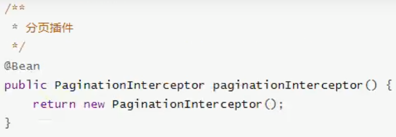
  - 创建一个Page\<User>对象     

###  配置

- ConfigLocation

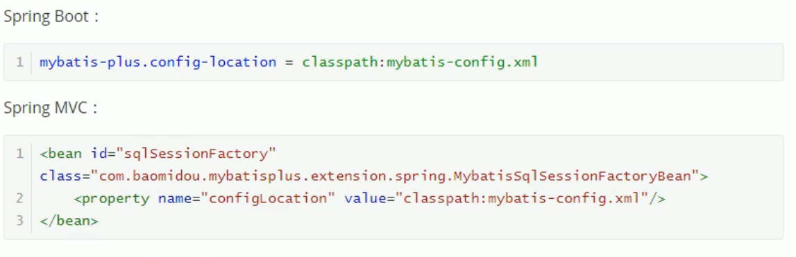

- MapperLocations  自定义sql语句

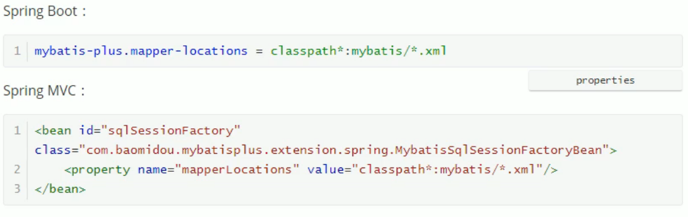

- TypeAliasesPackage         全局包扫描路径，别名扫描

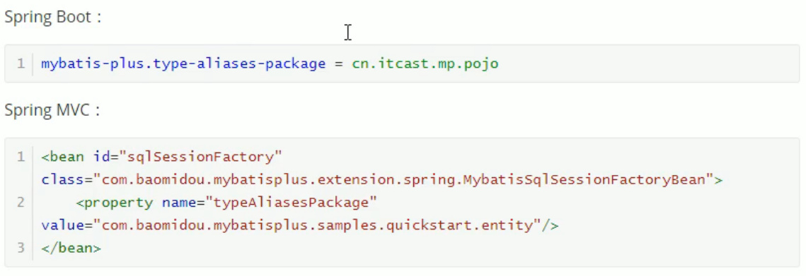

- MapUnderscoreToCamelCase         驼峰命名自动映射
  - 在mybatis 中默认是false的，plus 中默认是true的
  - 
- CacheEnabled    缓存
  - 默认是true 
  - 

### DB策略

- idType
  - 设置全局默认主键类型
  - 
- tablePrefix
  - 设置表名前缀
  - 

## 常见问题

### 找不到resource下的文件，在pom以下内容

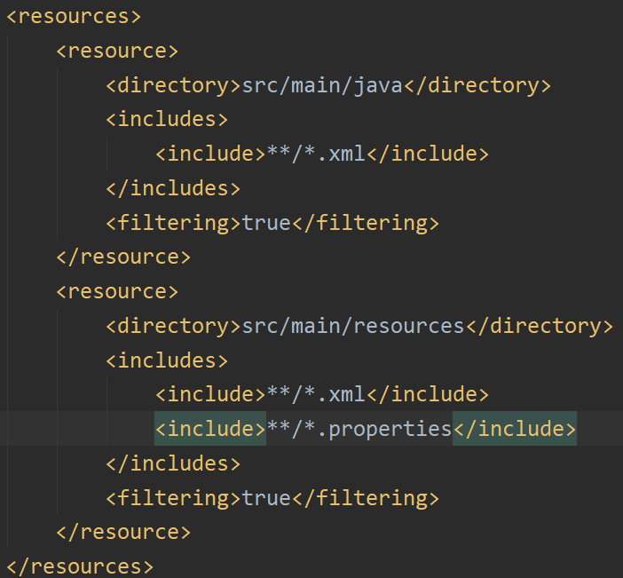

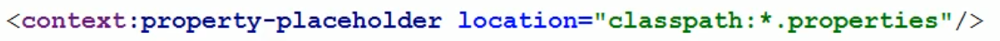

### 插入数据时id自增长异常

- 在实体类的id属性上添加@TableId(type = IdType.AUTO)

### 找不到与数据库表匹配的实体类

- 在实体类上添加@TableName("表名")

# ==缓存机制==

### 二级缓存

- 提升数据的检索效率
- 一级缓存为本地缓存（SqlSession）
  - SqlSession中有一个Excutor，Excutor中有一个localcache
  - 当用户发起查询时，mybatis会去localcache中查
  - ==分布式环境下可能会出现一个脏读的问题==

- 二级缓存为跨SqlSession的缓存
  - 即多个用户查询时，只要有一个SqlSession查询到数据后，就会加入二级缓存，其他SqlSession就可以直接从二级缓存中取数据
  - 在Excutor上做了一个装饰器（CachingExcutor），查询一级缓存前会先查这个
  - 二级缓存实现了多个SqlSession之间的共享，是一个全局的缓存，==缓存粒度==在namespace级别，可以通过Cache接口实现不同缓存实现类组合


# 技巧

## 实体类设计

- 继承Model实现CRUD
- 前提是需要有对应的Mapper类并基础BaseMapper\<T>

```java
@Data
@EqualsAndHashCode(callSuper = true)
@Accessors(chain = true)
public class User extends Model<User> {
    private Long id;
    private String name;
    private Integer age;
    private String email;
}
```

```java
public Boolean test(UserParam userParam){
    User user = new User();
    Beanutil.copyProperty(userParam, user);
    //增
    user.insert();
    //删
    user.deleteById();
    //改
    user.updateById();
    user.update(UpdateWrappers<User>对象);
    //查
    user.selectById();
    user.selectOne(QueryWrappers<User>对象);
    user.selectPage(IPage对象, QueryWrappers<User>对象);
}
```


## 一对多表修改

```java
/**
*  修改信息通用方法
*  exists 数据库存在的记录
*  params 修改时传的记录
*  T 是实体pojo
*  S 是对应的service对象，需要继承 IService
*  id 是一的id（主表id）
*  key 存id，value存记录
*/
public <T, S extends IService> Boolean updateCom(HashMap<String, T> exists, HashMap<String, T> params, S s, Long id){
    for (Map.Entry<String, T> entry : params.entrySet()) {
        //修改
        if (exists.containsKey(entry.getKey())) {
            s.update(entry.getValue(), new QueryWrapper<T>().eq("id", entry.getKey()));
        }
        //增加
        if ("null".equals(entry.getKey())) {
            T value = entry.getValue();
            BeanUtil.setFieldValue(value, "uid", id);
            s.save(value);
        }
    }
    for (Map.Entry<String, T> entry : exists.entrySet()) {
        //删除
        if (!params.containsKey(entry.getKey())) {
            s.remove(new QueryWrapper<T>().eq("id", entry.getKey()));
        }
    }
    exists.clear();
    params.clear();
    return true;
}
```

## 一对多分页查询

- 如果一对多多表查询中想要使用分页的话，mybatis的默认实现会有一些问题

  - 自动实现的分页原理是运行时加上动态加limit，但是再一对多关联查询中这个limit说不准确的，需要通过修改sql查询，手动添加limit才能正确显示

- ```sql
  #一对
  select * from (
  
  )
  ```
