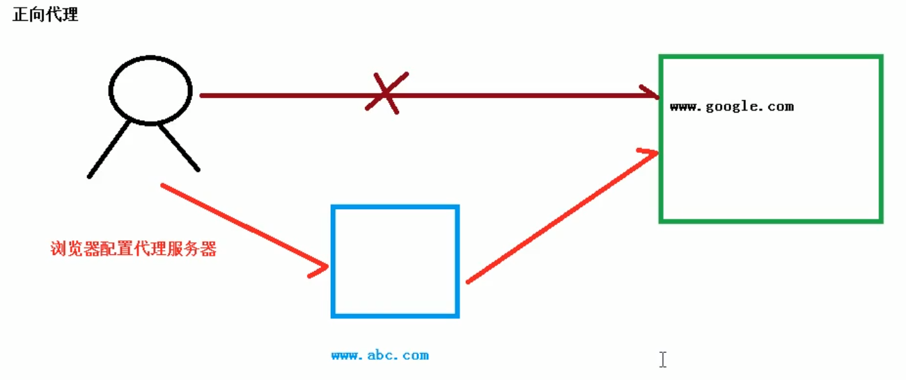
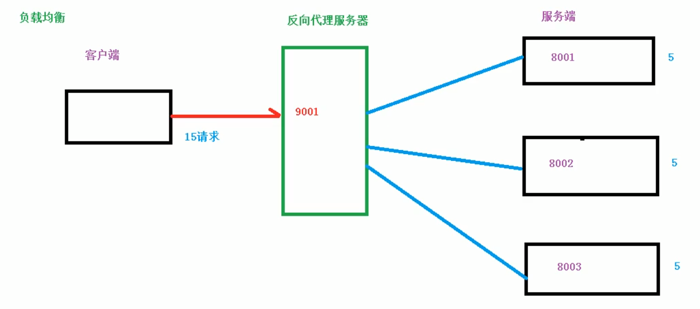
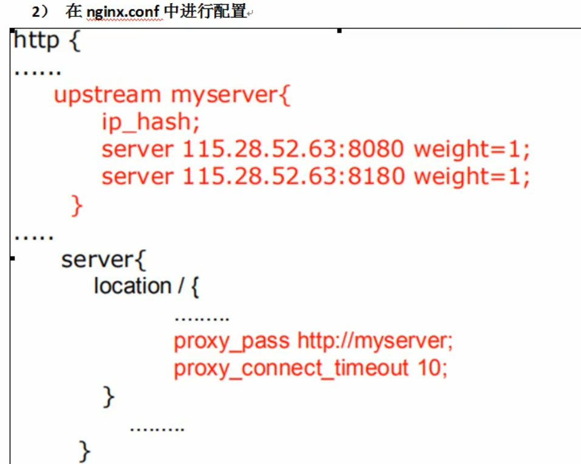
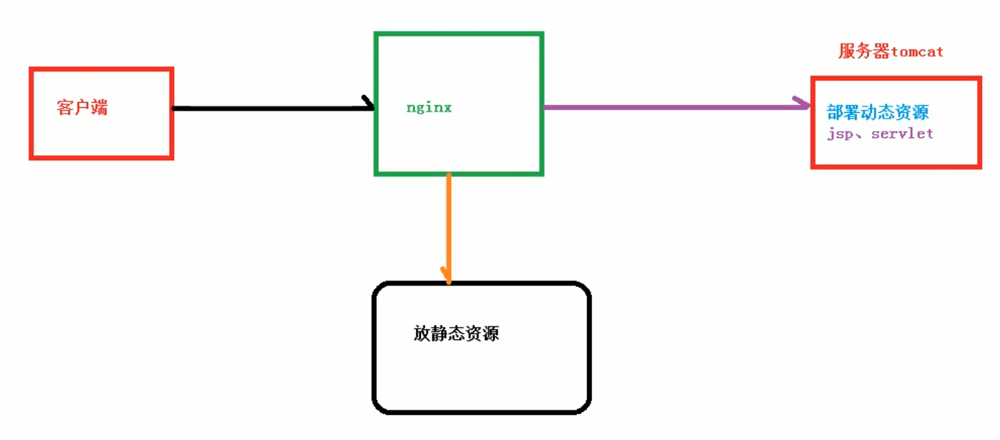

## 反向代理

### 定义

- 正向代理
  - 客户端挂了VPN访问外网

- 反向代理
  - 服务器挂了VPN传输数据给客户端
  - 这个VPN就是Nginx

## 负载均衡

### 策略

- 轮询（默认）
  - 每个请求按时间顺序分配到不同的服务器，如果服务器down会自动剔除
- weight（权重）
  - 默认是1，权重越高被分配的客户端越多
  - 一般按服务器性能分配
- ip_hash
  - 每个请求按照访问ip的hash结果进行分配，使每个访客固定访问一个服务器，
  - 可以解决session的问题
  
- fair
  - 按后端的响应时间来分配，响应时间短的优先分配

## 动静分离

- 就是把静态资源放置在一个独立的服务器上，不用每次都从jar包中加载，提高效率

### 实现方式

#### 方式一

- 把静态资源文件独立成单独的域名，放在独立的服务器上

#### 方式二

- 把动态和静态资源一起发布，通过nginx分离

---

## 配置文件

### 全局块（开头到events之间）

- worker_processes
  - 并发处理的数量

### events块

- 主要影响服务器与用户的网络连接
- worker_connections
  - 最大的连接数

### http块

- 代理、缓存、日志等大多数功能和第三方模块都在这配置
- 包含两大块
  - http全局块
    - 文件引入、定义、连接超时时间，连接请求数上限
  - server块
    - 和虚拟主机有关
    - 包含两大块
      - 全局server块
        - 端口、主机名
      - location块
        - 地址

## 常用命令

- 需要进入到 ../nginx/sbin/  下执行
  - service start nginx          启动nginx
  - ./nginx -s stop              关闭nginx 
  - ./nginx -s quit              安全退出
  - ./nginx -s reload            重新加载nginx配置文件

## Nginx常见问题

- Nginx为什么快
  - 采用了异步非阻塞模式，使用了epoll模型以及队列
- Nginx的优缺点
  - 优点：占用内存小，响应快，支持高并发，配置简单，不会暴露服务器ip地址
  - 缺点：处理动态页面鸡肋
- Nginx使用的场景
  - 静态服务器，虚拟主机，反向代理，动静分离，负载均衡，限流
- 限流的方式
  - 正常流量限制访问频率
  - 突发流量限制访问频率
  - 限制并发连接数
- 漏桶流和令牌桶
  - 漏桶流
    - 突发流量转变为平稳的流量，大口进，小口出
  - 令牌桶
    - 有一个大小固定的令牌桶，以固定的速度生成令牌并放入令牌桶中，拿到令牌的请求才可以执行对应的业务逻辑

