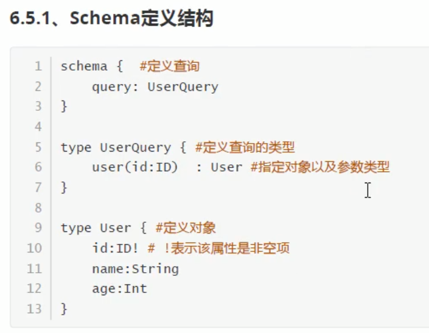
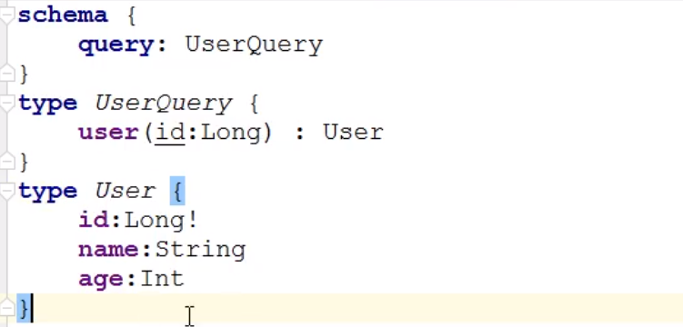
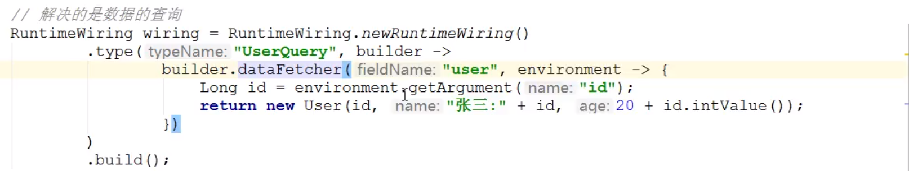
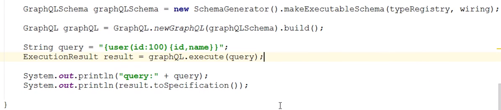

# GraphQL

- Restful存在的弊端
  - 想要部分数据，但是返回的有多余的数据，资源浪费
  - 一次请求不能满足需求
- 按需索取资源、一次查询多个数据、无需划分版本
- 
  - 
  - 
  - 
  - 
- ../../pic-Java
  - 
    - 需要添加第三方库才能下载使用，Maven配置第三方库
      - 

  - 使用SDL构建
    - 在resources下创建user.graphqls
      - 

    - 
    - 
    - 
  - 对象嵌套
  - 参数可以是变量，服务器需要处理变量，
  
  ## 使用
  
  - 在.graphql文件中定义查询
  
    - 查询名、参数、返回值、返回值类型
  
  - 在GraphQLController中添加方法
  
    - ```java
      @RequestMapping("graphql")
      @Controller
      public class GraphQLController{
          @Autowired
          private GraphQL graphQL;
          @GetMapping
          @ResponseBody
          public Map<String, Object> query(@RequestParam("query") String query){					
              return this.graphQL.execute(query).toSpecification();//标准输出，返回的时Map类型
          }
      }
      ```
  
  - 创建GraphQLProvider，用于初始化GraphQL
  
    - 初始化GraphQL对象
  
    - 读取.graphql文件，使用GraphQLSchema解析
  
    - 指定查询的数据，创建一个MyDataFetcher接口，动态的传入查询的名称和数据
  
    - ```java
      @Component
      public class GraphQLProvide{
          private GraphQL graphQL;
          
          //MyDataFetcher实现类的集合
          @Autowired
          private List<MyDataFetcher> myDataFetchers;
          
          //初始化GraphQL对象
          @PostConstruct//在Spring初始化时执行
          public void init() throws FileNotFoundException{
              //读取外部GraphQL文件并解析
              File file = ResourceUtils.getFile("classpath:haoke.graphqls");
              this.graphQL = GraphQL.newGraphQL(buildGraphQLSchema(file)).build();
          }
          
          //构建GraphQLSchema
          private GraphQLSchema buildGraphQLSchema(File file){
              TypeDefinitionRegistry typeRegistry = new SchemaParser().parse(file);
              return new SchemaGenerator().makeExecutableSchema(typeRegistry, buildWiring());
          }  
      
          //构建RuntimeWiring 优化
          private RuntimeWiring buildWiring(){
              return RuntimeWiring.newRuntimeWiring().type("HaokeQuery", builder -> {
                  for(MyDataFetcher myDataFetcher : myDataFetchers){
                      builder.dataFetcher(myDataFetcher.fieldName(), 
                                          enviroment -> myDataFetcher.dataFetcher(enviroment));
                  }
                  return builder;
              }).build();
          }
                                                           
          @Bean
          public GraphQL graphQL(){
              return this.graphQL;
          }
      }
      ```
  
  - 创建MyDataFetcher接口，其实现类实现获取查询名和数据的功能
  
    - ```java
      public interface MyDataFetcher{
          //GraphQL查询的名称
          String fieldName();
          //查询数据，enviroment中有参数
          Object dataFetcher(DataFetchingEnviroment enviroment);
      }
      ```
  
  - 创建实现类
  
    - ```java
      @Component
      public class XXXDataFetcher implements MyDataFetcher{
          @Autowired
          private XXXService xxxService;
          
          //GrapgQl查询名
          @Override
          public String fieldName(){
              return "xxx";
          }
          
          //通过参数查询数据
          @Override
          public Object dataFetcher(DataFetchingEnviroment enviroment){
              Long xxx = enviroment.getArgument("xxx");
              return this.xxxService.query(xxx);
          }
      }
      ```
  
  # 