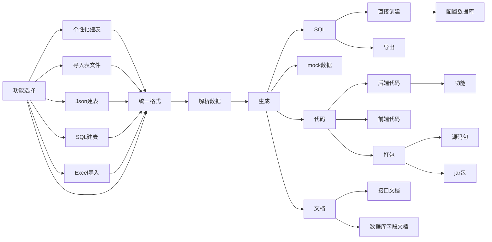

## 功能模块

```mermaid
graph LR;
	功能选择 --> 个性化建表;
	功能选择 --> 导入表文件;
	功能选择 --> Json建表;
	功能选择 --> SQL建表;
	功能选择 --> Excel导入;
	个性化建表 --> 统一格式;
	导入表文件 --> 统一格式;
	Json建表 --> 统一格式;
	SQL建表 --> 统一格式;
	Excel导入 --> 统一格式;
	功能选择 --> 统一格式;
	统一格式 --> 解析数据;
	解析数据 --> 生成;
	生成 --> SQL;
	生成 --> mock数据;
	生成 --> 代码;
	生成 --> 文档;
	文档 --> 接口文档;
	文档 --> 数据库字段文档;
	代码 --> 后端代码;
	代码 --> 前端代码;
	代码 --> 打包;
	打包 --> 源码包;
	打包 --> jar包;
	后端代码 --> 功能;
	SQL --> 直接创建;
	直接创建 --> 配置数据库;
	SQL --> 导出;
```

