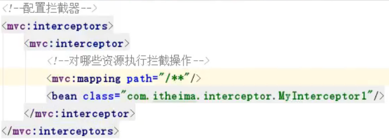
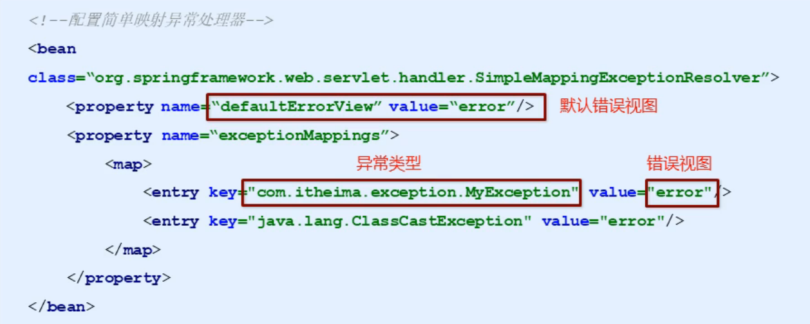

## 文件上传

- 客户端三要素
  - post提交方式
  - type = file
  - 表单需要有enctype = "multipart/form-data" (多部份表单形式)
  
- 服务器端
  
  - 导入 commons-filepload 和 commons-io 依赖
  
  - 配置文件上传解析器
  
    - ```xml
      <bean id="multipartResolver" class="org....">
          <!--总大小-->
      	<property name="maxUploadSize" value="5242800"/>
      	<!--单个文件大小-->
          <property name="maxUploadSizePerFile" value="5242800"/>
          <!--文件编码类型-->
          <property name="defaultEncoding" value="UTF-8"/>
      </bean>
      ```
  
  - 文件上传代码
  
    - ```java
      @RequestMapping("/upload")
      @Responsebody
      public void Upload(String name, MultipartFile uploadFile){
          //获得文件名称
          String file = uploadFile.getOriginalFilename();
          //保存文件
          uploadFile.transferTo(new File("路径"));
      }
      ```
  
      - uploadFile 这个形参名需要和客户端提交的文件名一致
  

## 开启静态资源访问

- ```xml
  <mvc:resources mapping="/资源文件夹/**"	location="/资源文件夹/"/>
  ```

- ```xml
  <mvc:default-servlet-handler/>
  ```

## 解决乱码问题

- 配置全局过滤的filter

  - ```xml
    <filter>
    	<filter-name>CharacterEncodingFilter</filter-name>
        <filter-class>
           org.springframework.web.filter.CharacterEncodingFilter
        </filter-class>
        <init-param>
        	<param-name>encoding</param-name>
            <param-value>UTF-8</param-value>
        </init-param>
    </filter>
    <filter-mapping>
    	<filter-name>CharacterEncodingFilter</filter-name>
        <url-pattern>/*</url-pattern>
    </filter-mapping>
    ```

## 拦截器（Interceptor）

- 自定义拦截器
  - 创建拦截器类实现HandlerInterceptor接口
    - preHandle()
      - 处理前被调用
      - 有返回值，返回false后续的方法都不会执行了
    - postHandle
      - 处理之后被调用
      - 在DispatcherServlet进行视图渲染之前调用，所以我们可以对ModelAndView对象进行操作
    - afterCompletion
  - 配置拦截器，xml或者配置类
    - 

## 异常处理

### SimpleMappingExceptionResolver(简单映射异常处理器)



### HandlerExceptionResolver(异常处理接口)

- 创建一个类实现此接口
- 配置

## 注解

### @RequestMapping

- method  请求方式
  - method = RequestMethod.请求方式
- params   指定限制请求参数的条件，支持简单的表达式
- 页面跳转
  - 直接返回字符串
    - 进行视图跳转
  - 通过ModelAndView对象返回
    - new一个ModelAndView对象进行返回

### @RequestBody

- 将前端传递过来的Json数据映射到类上

### @ResponseBody

- 将后端返回的数据封装为Json格式返回

### @RequestParam

- 当请求的参数名称与业务方法上形参的名字不一致时，使用该注解命名
  - value                客户端请求的参数名
  - required           是否必须包含value值，默认时true，没有则报错
  - defaultValue    默认值

### @PathVariable

- 在请求映射上添加占位符(请求方式为get)
  - @RequestMapping("/user/**{username}**");
    - 可以用method 来区分请求方式
  - 形参前加**@PathVariable**(value="username")
    - username 的值会自动赋值给形参

### @RequestHeader

- 获得请求头信息
  - value       请求头名字
  - required  是否必须携带此请求头

### @CookieValue

- 可以获得指定的Cookie的值

### @RestController

- @ResponseBody  +  @Controller

### @CrossOrigin

- 处理Ajax请求的跨域问题

## 原理

### SpringMVC工作流程

1. 用户发起HttpRequest请求，请求进入到 DispatcherServlet
   - 默认路径是 “ / ”，会匹配到所有的url
   - SpringBoot会自动创建并加载DispatcherServlet的Bean
     - 会创建Spring容器并执行refresh方法
   - 第一次请求来时会初始化DispatcherServlet，然后到容器中找它依赖的组件，没有就用默认的
     - HandlerMapping、HandlerAdapter、HandlerExceptionResolver、ViewResolver 
2. DispatcherServlet 将请求转发给所有的 HandlerMapping，HandlerMapping 会找到能处理这些请求的Handler方法
   - 这些Handler方法会被封装成HandlerMethod对象，并结合匹配到的拦截器，合并成HandlerExecutionChain（调用链）对象，然后一起返回给DispatcherServlet 
   - HandlerMapping 会在初始化时就会建立好请求路径和处理器的映射关系
3. DispatcherServlet 收到这条调用链后 
   - 调用所有拦截器的preHandle方法，返回true才继续后续的调用
   - 调用HandlerAdapter解析HandlerMethod并调用对应的Handler方法，准备数据绑定工厂、模型工厂，将HandlerMethod完善为ServletInvocableHandlerMethod
     - 使用HandlerMethodArgumentResolver参数解析
     - 调用ServletInvocableHandlerMethod
     - 调用HandlerMethodReturnValueHandler处理返回值
       - 有@ResponseBody注解的话直接返回Json
       - 否则返回的是 ModelAndView ，然后进行视图解析和渲染
   - 调用拦截器的postHandle方法
4. 视图渲染或处理异常
   - 如果1 - 3出现异常，ExceptionHandlerExceptionResolver处理
     - @ControllerAdvice增强5：@ExceptionHandler异常处理
   - 视图解析即渲染
     -  将 ModelAndView 转发给 ViewResolver 处理并返回 View 对象给 DispatcherServlet
     - DispatcherServlet 再将渲染后的页面返回给客户端
5. 调用拦截器的afterCompletion方法
