# BIO（同步阻塞）

## 一. 字节流

### FileInputStream  文件字节输入流

- int read()                                         读取一个字节
- int read(byte[] buffer)                      读取多个字节存入b
  - b有缓存作用，一般定义为n个k字节(1024比特)
- byte[] readAllBytes()                       一次性全部读取
- FileInputStream(String name)        在name路径下创建文件写入数据
- FileInputStream(File file)                在file文件中写入数据

### FileOutputStream 文件字节输出流

- close()                                          关闭并刷新
- flush()                                       	刷新数据
- write(int b)                                    写一个字节
- write(byte[] b)                               写一个字节数组
  - 正数0-127 会查ASCII码表
  - 负数会和后一个字节组成中文 查询GBK表
- write(byte[] b, int off, int len)        写一个字节数组的一部分
- os.write("\r\n".getBytes())                              实现写数据时换行
- FileOutputStream(String name)       在name路径下创建文件写入数据
- FileOutputStream(File file)               在file文件中写入数据

## 二.字符流

### FileReader

- read()                                   读取一个字符，读完返回-1
- read(char[] buffer)                读取一个字符数组，返回读取个数

### FileWriter

- write(int c)                                          写一个字符
- write(char[] cbuf)                                写一个字符数组                              
- write(char[] cbuf, int off, int len)         写字符数组的一部分
- write(String str)                                  写一个字符串
- write(String str, int off, int len)            写字符串的一部分
- FileWriter(String filepath, boolean append)        在一个文件后追加内容
- close()                                          关闭并刷新
- flush()                                       	刷新数据

## 三.缓冲流

### 字节缓冲流

#### BufferedInputStream

#### BufferedOutputStream

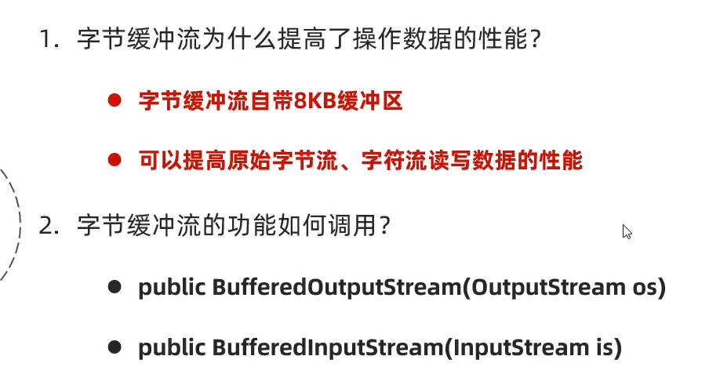

### 字符缓冲流

#### BufferedReader

- readLine()                          读取一行数据

#### BufferedWrite

- newLine()                           换行

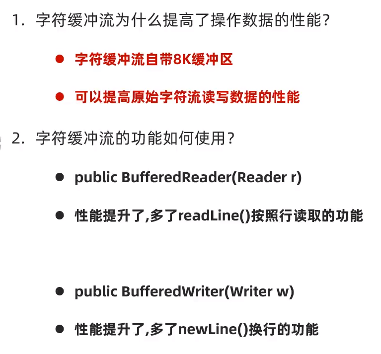

## 四.转换流

### 字符输入转换流


### 字符输出转换流


## 五.序列化

### 对象字节输入流（反序列化）

#### ObjectInoutStream

- readObject()

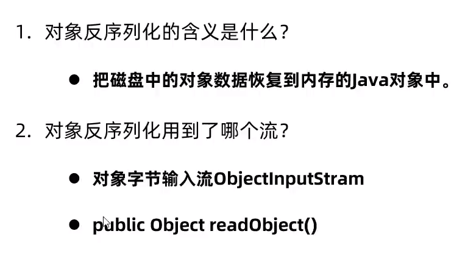

### 对象字节输出流（序列化）

#### ObjectOutoutStream

- writeObject()

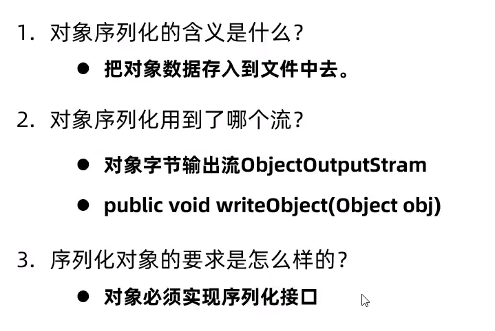

### InvalidClassException

- 反序列化时可能出现的异常

- 解决方案：
  - 可以在类中添加序列号serialVersionUID
    - static final long serialVersionUID=1L 

## 六.打印流

- 只负责数据的输出，而且不会抛出IOException
- 改变输出语句的目的地：
  - 使用System.setOut(打印流对象)	

### PrintStream 字节输出流

### PrintWriter 字符输出流	

## 七.数据流

### DataInputStream

- readUTF()

### DataOutputStream

- writeUTF()

## 网络编程

### Java.net.Socket

- 此类实现**客户端套接字**（也可以就叫“套接字”）套接字是两台机器间通信的端点。

- 构造方法

  - `Socket(String host,  int port)`			

    - 创建一个流套接字并将其连接到指定主机上的指定端口号。

    - String host		 服务器IP地址/服务器域名


    - int port			   服务器端口号

- 成员方法：

  - getInputStream()			            返回次套接字的输入流

  - getOutputStream()		             返回此套接字的输出流

  - shutdowmInput						  关闭网络输入流

  - shutdowmOutput					   关闭网络输出流，并在末端添加结束标志

### Java.net.ServerSocket

- 此类实现**服务器套接字**。

- 构造方法：
  - `ServerSocket(int port)`
    - port 		端口号

- 成员方法：
  - `Socket accept()`				侦听并接受到此套接字的连接	

### BIO实现接受多个客户端的弊端


### 伪异步IO编程

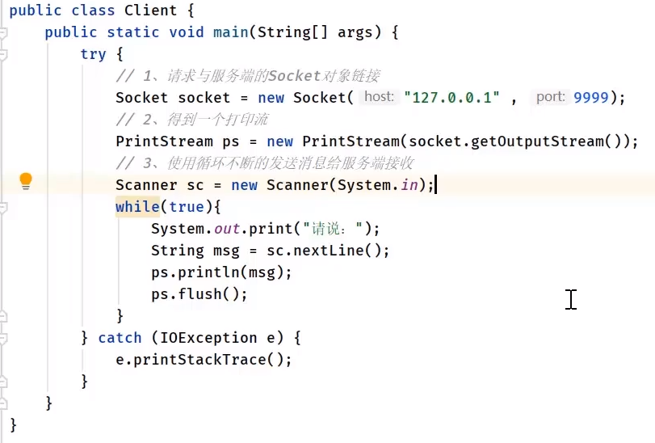


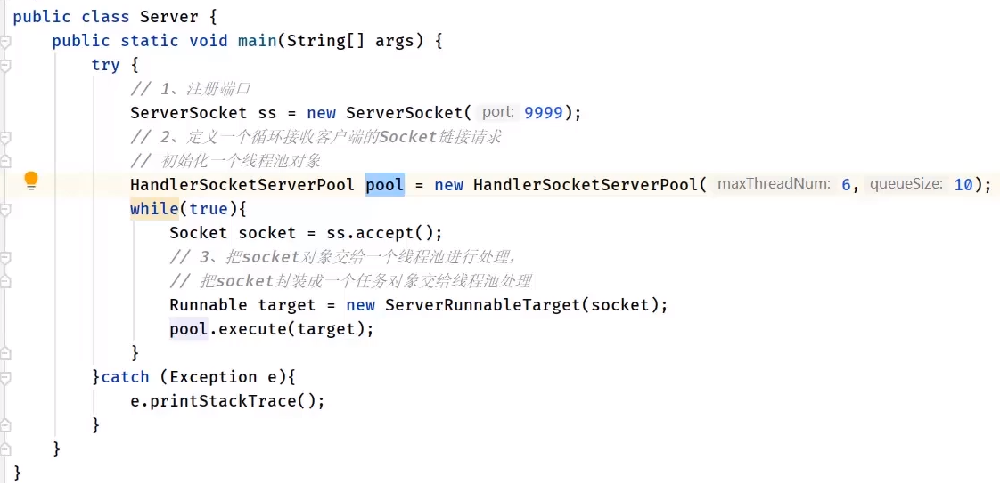

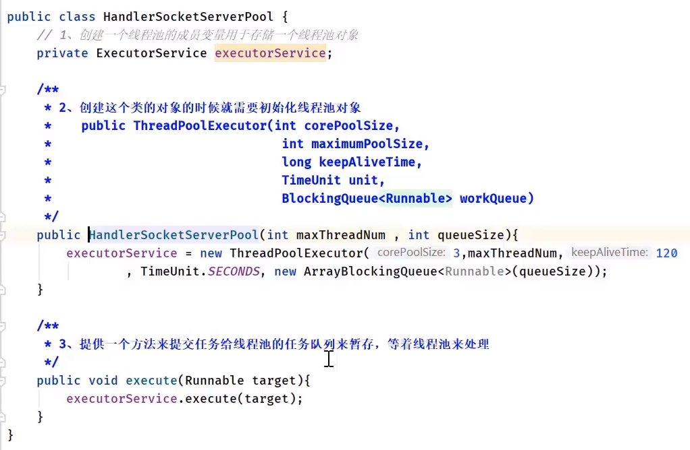


### 端口转发

# NIO（同步非阻塞）

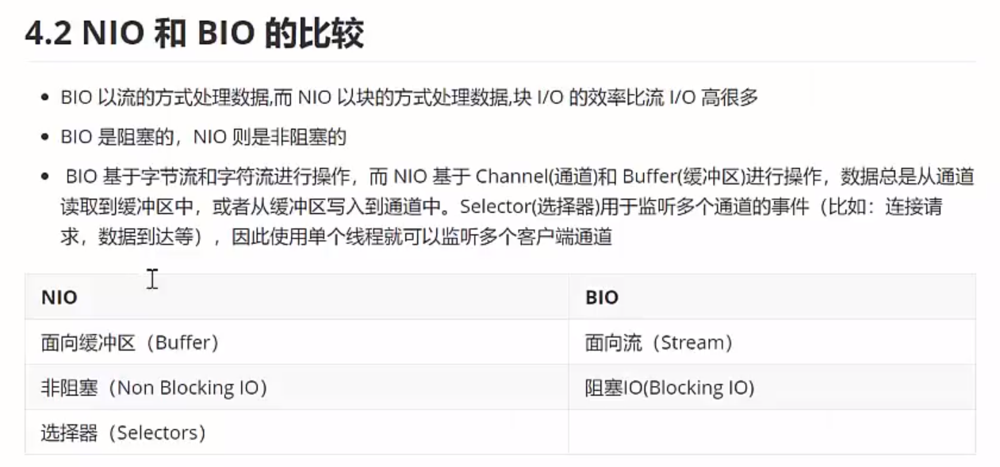

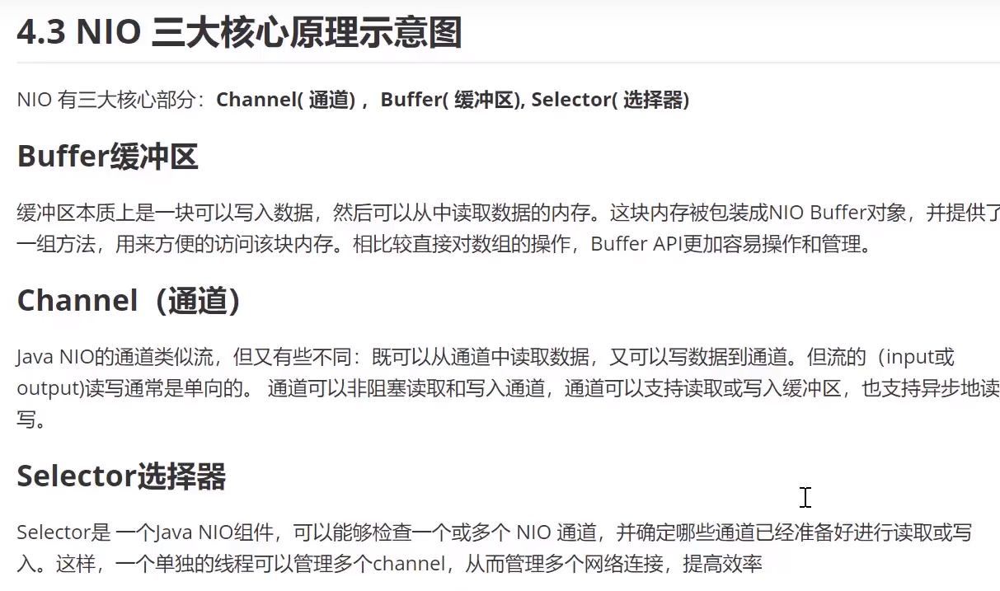

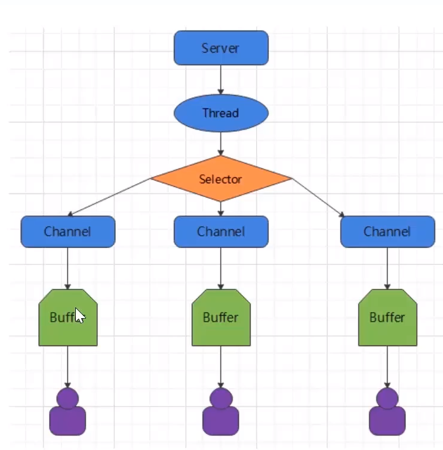


## Buffer

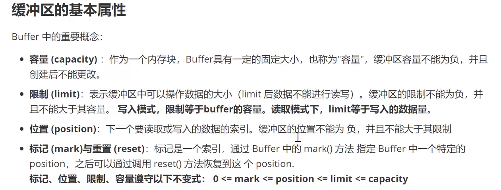

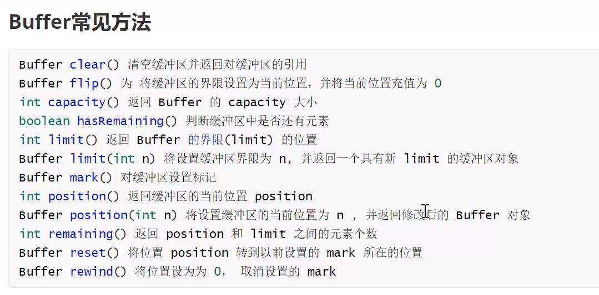

- clear方法不会清除数据，它只会把position的位置设为0


### 直接内存和非直接内存

- 直接内存性能、效率更高
  - 直接内存申请时需要耗费较高的性能
  - 需要传输大数据，而且生命周期要长，频繁的IO操作，那么适合申请直接内存
- 非直接内存是堆内存
  - 不需要很明显的性能提升则推荐使用堆内存
- 可以通过 isDirect() 方法判断是否是直接内存

```java
public void test(){
    //申请直接内存
    ByteBuffer buffer = ByteBuffer.allocateDirect(1024);
    //申请非直接内存
    ByteBuffer buffer = ByteBuffer.allocate(1024);
}
```

## Channel


### transferFrom()

- 从目标通道中去复制原通道数据

### transferTo()

- 把原通道的数据辅复制到目标通道

## Selector

- 可使一个线程管理多个通道，是非阻塞IO的核心

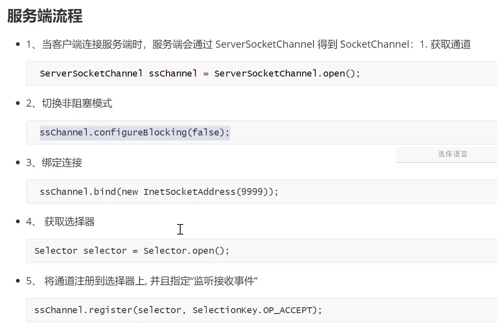

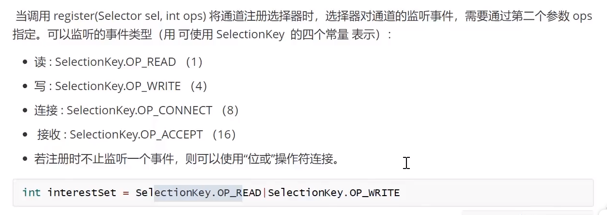

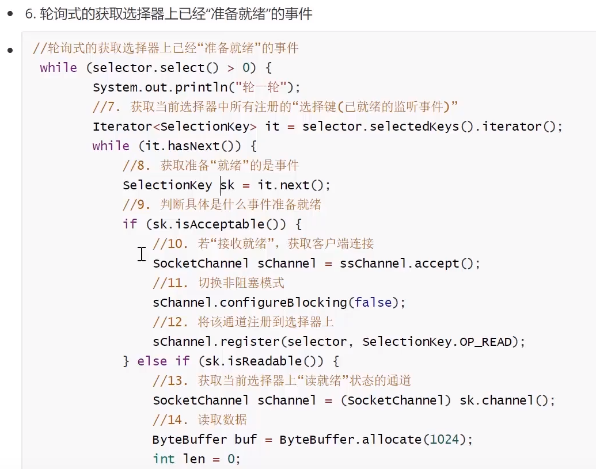

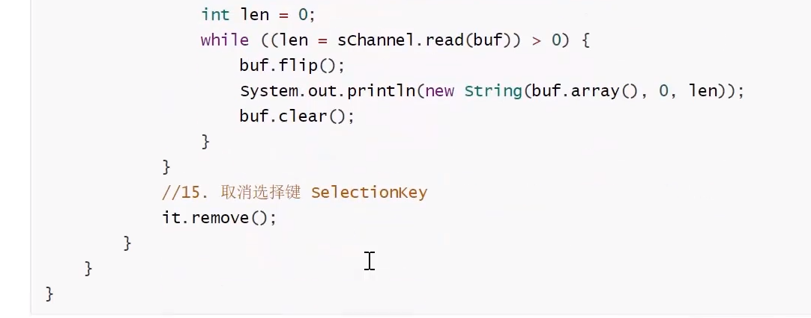


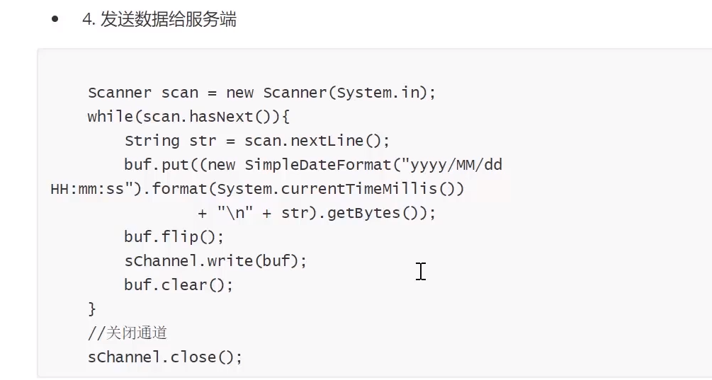

# IO多路复用（异步阻塞）

### Select

```c
//创建socket服务端
sockfd = socket(AF_INET, SOCK_STREAM, 0);
meset(&addr, 0, sizeof(addr));
addr.sin_family = AF_INET;
addr.sin_port = htons(2000);
addr.sin_addr.s_addr = INADDR_ANY;
bind(sockfd, (struct sockaddr*)&addr, sizeof(addr));
listen(sockfd, 5);
//准备文件描述符fds
for(i = 0; i < 5; i++){
    meset(&client, 0, sizeof(client));
    addrlen = sizeof(client);
    fds[i] = accept(sockfd, (struct sockaddr*)&client, &addrlen);
    //求出文件描述符中的最大值，因为不是连续的
    if(fds[i] > max) max = fds[i];
}

while(1){
    FD_ZERD(&rset);
    for(i = 0; i < 5; i++){
    	FD_SET(fds[i], &rset);   
    }
    prints("round again");
    
    //max-1：需要监听的事件的总长度
    select(max-1, &rset, NULL, NULL, NULL);
    
    for(i = 0; i < 5; i++){
        if(FD_ISSET(fds[i], &rset)){
            meset(buffer, 0, MAXBUF);
            read(fds[i], buffer, MAXBUF);
            puts(buffer);
		}
    }
}
```

- rset是一个bitmap，用来表示哪几个文件描述符是被监听的，大小是1024位
- 执行select函数是会将用户态的rset复制到内核态中，交给内核来判断事件，是一个阻塞函数，当事件有变动时会将fds对应的事件置位，然后返回

### poll

```c
struct pollfd{
    int fd;
    //在意的事件
    short events;
    //是否有变动 / 是否置位
    short revents;
}
//准备socket客户端
//准备文件描述符fds
for(i = 0; i < 5; i++){
    meset(&client, 0, sizeof(client));
    addrlen = sizeof(client);
    //声明socket的文件描述符
    poolfds[i].fd = accept(sockfd, (struct sockaddr*)&client, &addrlen);
    poolfds[i].events = POLLIN
}

sleep(1);
while(1){
    prints("round again");
    poll(pollfds, 5, 50000);
    
    for(i = 0; i < 5; i++){
        if(pollfds[i].revents & POLLIN){
            pollfds[i].revents = 0;
            meset(buffer, 0, MAXBUF);
            read(pollfds[i].fd, buffer, MAXBUF);
            puts(buffer);
		}
    }
}
```

- 执行poll函数是会将用户态的pollfd复制到内核态中，交给内核来判断事件，
- 是一个阻塞函数，当事件有变动时会将pollfd中的revents置位为1，然后返回，然后再将pollfd中的revents置位为0，可重用

### epoll

- epoll使用一个文件描述符管理多个描述符，将用户关心的文件描述符的事件放到内核中的一个事件表，这样在用户空间和内核空间只需要复制一次

- epoll结构

  - 在内核态中，用户通过一个fd就可以找到内核态中epoll
  - 有一个监听列表、就绪队列和等待队列
    - 监听列表是红黑树结构的
    - 等待队列保存的是调用epoll_wait的进程

- epoll有三个接口

  - `int epoll_create(int size)`

    - 在内核态中开一个epoll空间并给用户空间一个访问的id
    - `int epoll_ctl(int epfd, int op, int fd, struct epoll_event *event)`

    - op：表示请求类型（ADD， MOD， DEL）
    - fd：需要监听的文件描述符，一般指socket_fd
    - struct epoll_event *event

      - event：表示想要感知的事件状态（EPOLLIN、EPOLLOUT......）

  - `int epoll_wait(int epfd, struct epoll_event *event, int maxevents, int timeout)`

    - 将就绪列表的数据拷贝到一个数组中返回
    - 如果就绪列表为空返回-1
    - 如果timeout大于0则会阻塞相应的时间，如果是-1则一直阻塞

- epoll对文件操作符的操作有两种模式（**触发方式**）

  - LT（水平触发）：
    - 事件就绪后，用户可以选择处理或不处理，如果用户不处理，那么下次调用epoll_wait方法是还会将未处理的事件返回，即不会删除就绪列表中未处理的事件

  - ET（边缘触发）：
    - 事件就绪后，用户必须处理，因为就绪列表在返回后已经清空了


```c
struct epoll{
    int fd;
    //在意的事件
    epoll_event events;
}
struct epoll_event{
    _uint32_t events;
    epoll_data_t data;
}

int epfd = epoll_create(10);
struct epoll_event events[5];

for(i = 0; i < 5; i++){
    static struct epoll_event ev;
    meset(&client, 0, sizeof(client));
    addrlen = sizeof(client);
    ev.data.fd = accept(sockfd, (struct sockadd*)&client, &addrlen);
    ev.events = EPOLLIN;
    epoll_ctl(epfd, EPOLL_CTL_ADD, ev.data.fd, &ev);
}

while(1){
    puts("round again");
    nfds = epoll_wait(epfd, events, 5, 10000);
    
    for(i = 0; i < nfds; i++){
        meset(buffer, 0, MAXBUF);
        read(events[i].data.fd, buffer, MAXBUF);
        prints(buffer);
    }
}
```

### 区别

- select
  - 需要每次都传一个rset，是一个bitmap，默认长度是1024位，难以修改
  - 每次都要将就绪的事件置位后拷贝到内核空间，开销还是比较大的
  - 下一轮循环时需要将rset重新置位为0，rset不能复用
  - 当有事件就绪时不能明确知道是哪个事件，每次都需要遍历，O(n)
- poll
  - 不是使用rset而是使用了一个pollfd结构，可重用
  - 每次都要将就绪的事件置位后拷贝到内核空间，开销还是比较大的
  - 当有事件就绪时不能明确知道是哪个事件，每次都需要遍历，O(n)
- epoll
  - epoll是在内核态中创建的，对用户空间暴露一个fd引用，开销小
  - 当事件有变动时加入就绪队列

# AIO（异步非阻塞）

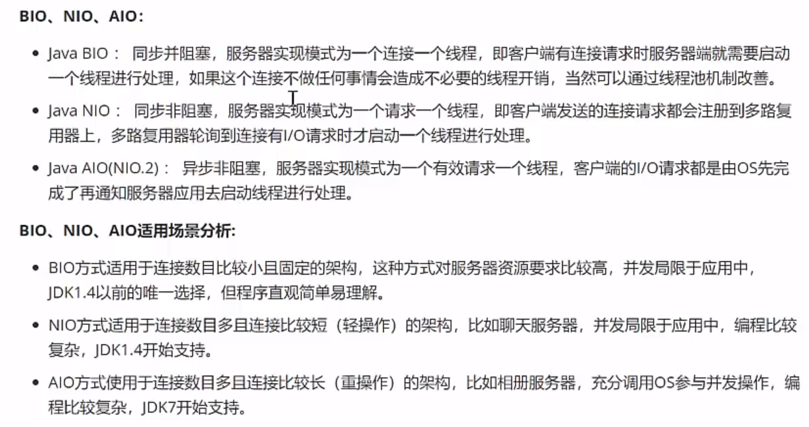
