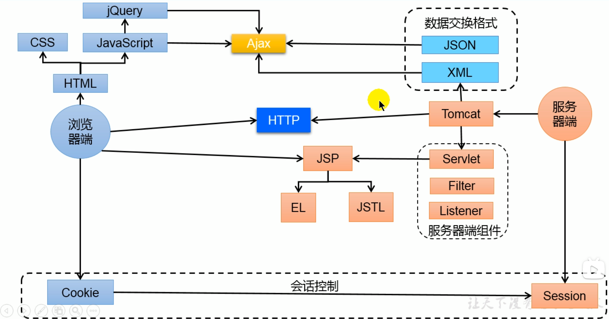

## HTML和CSS

### 列表

- ul        无序列表
  - li			列表项
- ol        有序列表

### Form

- 提交的表单项需要有name属性才能被服务器接收
- 单选，复选，下拉列表中的option 都需要添加value属性才能被服务器收到
- 如果表单项不在form标签中，服务器就接收不到信息
- Get方式的数据长度不超过100个字符
- Post方式的数据长度没有长度限制

### Div、span、p

- Div			默认独占一行
- span       长度是封装数据的长度
- p             默认会在段落的上方和下方各空出一行（如果已有空行就不再空）

## JDBC

### 获取数据库连接

- 方式一(通过第三方api)

  - ```java
    Driver driver = new com.mysql.jdbc.Driver();
    String url = "jdbc:mysql://localhost:3306/test";
    Properties info = new Properties();
    info.setProperty("user","root");
    info.setProperty("password","");
    Connection connect =driver.connect(url,info);
    ```

- 方式二(通过反射)

  - ```java
    Class clazz = Class.forName("com.mysql.cj.jdbc.Driver");
    Driver driver = (Driver) clazz.getConstructor().newInstance();
    String url = "jdbc:mysql://localhost:3306/test?useUnicode=true&characterEncoding=utf-8 ";
    Properties info = new Properties();
    info.setProperty("user","root");
    info.setProperty("password","");
    Connection conn =driver.connect(url,info);
    ```

- 方式三(通过DriverManager)

  - ```java
    //获取Driver实现类
    Class aClass = Class.forName("com.mysql.cj.jdbc.Driver");
    Driver driver = (Driver) aClass.getConstructor().newInstance();
    //提供连接需要的信息
    String url = "jdbc:mysql://localhost:3306/test";
    String user = "root";
    String password = "";
    //注册驱动
    DriverManager.registerDriver(driver);
    //获取连接
    Connection conn = DriverManager.getConnection(url,user,password);
    ```

- 方法四（加载驱动）

  - ```java
    //提供连接需要的信息
    String url = "jdbc:mysql://localhost:3306/test";
    String user = "root";
    String password = "";
    //加载Driver（可以省略，最好不省略）
    Class.forName("com.mysql.cj.jdbc.Driver");
    //获取连接
    Connection conn = DriverManager.getConnection(url,user,password);
    ```

    - 因为加载Driver类会执行其内部的静态代码块，会进行注册

- 方法五（读配置文件）------主要用这个

  - ```java
    //加载配置文件（获取类加载器加载资源文件）
    InputStream is = ClassLoader.getSystemClassLoader().getResourceAsStream("JDBC.properties");
    Properties prop = new Properties();
    //读取配置信息
    prop.load(is);
    String user = prop.getProperty("user");
    String password = prop.getProperty("password");
    String url = prop.getProperty("url");
    String driverClass = prop.getProperty("driverClass");
    //获取Driver实现类
    Class.forName(driverClass);
    //获取连接
    Connection conn = DriverManager.getConnection(url, user, password);
    ```

    - 数据和代码的分离，实现了解耦
    - 如果需要修改配置信息，不需要重新打包程序

### `preparedstatement`

#### 增/删/改

- 普通写法
  - ```java
    //1.获取数据库连接
    //2.预编译sql语句
    String sql = "insert into customers(name,email,birth)values(?,?,?)";
    ps = conn.prepareStatement(sql);
    //3.填充占位符
    ps.setString(1,"哪吒");
    ps.setString(2,"156@qq.com");
    SimpleDateF6ormat sdf = new SimpleDateFormat("yyyy-MM-dd");
    java.util.Date date = sdf.parse("1111-11-11");
    ps.setDate(3, new Date(date.getTime()));
    //4.执行sql
    ps.execute();
    //5.释放资源
    ```

- 通用写法

  - ```java
    public static void GeneralUpdate(String sql,Object...args){
            Connection conn = null;
            PreparedStatement ps = null;
            try {
                //1.获取数据库连接
                conn = JDBCUtil.getConnection();
                //2.预编译sql语句
                ps = conn.prepareStatement(sql);
                //3.t
                for (int i = 0; i < args.length; i++) {
                    ps.setObject(i+1,args[i]);
                }
                //4.执行sql
                ps.execute();
            } catch (Exception e) {
                e.printStackTrace();
            } finally {
                //5.释放资源
                JDBCUtil.closeResource(conn,ps);
            }
    }
    ```

    

#### 查（针对同一张表的查询）

- 普通写法

  - ```java
    conn = JDBCUtil.getConnection();
    String sql = "select id,name,email,birth from customers where id = ?";
    ps = conn.prepareStatement(sql);
    ps.setObject(1,1);
    resultSet = ps.executeQuery();
    if (resultSet.next()){
        int id = resultSet.getInt(1);
        String name = resultSet.getString(2);
        String email = resultSet.getString(3);
        Date birth = resultSet.getDate(4);
        Customer customer = new Customer(id,name,email,birth);
        System.out.println(customer);
    }
    JDBCUtil.closeResource(conn,ps,resultSet);
    ```

    - 需要知道查询的准确列数和列的类型，不灵活

- 通用写法

  - ```java
    //获取连接
    conn = JDBCUtil.getConnection();
    //预编译sql
    ps = conn.prepareStatement(sql);
    //填充占位符
    for (int i = 0; i < args.length; i++) {
        ps.setObject(i+1,args[i]);
    }
    //获取查询的结果集
    resultSet = ps.executeQuery();
    //获取结果集的元数据
    ResultSetMetaData metaData = resultSet.getMetaData();
    //获取结果集中字段的个数
    int columnCount = metaData.getColumnCount();
    //判断结果集是否有数据
    if(resultSet.next()){
        //创建一个customer对象来存取结果集中的数据
        Customer customer = new Customer();
        //循环遍历结果集
        for (int i = 0; i < columnCount; i++) {
            //获取字段的值
            Object ColumnValue = resultSet.getObject(i+1);
            //获取字段名
            String ColumnName = metaData.getColumnLabel(i + 1);
            //为customer中对应的字段赋值，通过反射
            Field field = Customer.class.getDeclaredField(ColumnName);
            field.setAccessible(true);
            field.set(customer,ColumnValue);
        }
        return customer;
    }
    JDBCUtil.closeResource(conn,ps,resultSet);
    ```

    - 利用反射获取字段的值，利用元数据获取字段名，再给对象属性赋值
    - 使用getColumnLabel来替换getColumnName
      - getColumnLabel获取列的别名，用于类属性名和数据库列名不一致的情况，没有别名会使用字段名

#### 查（针对不同表的通用查询，返回一条记录）

- ```java
  //泛型方法
  public static <T> T getInstance(Class<T> clazz,String sql,Object...args){
      Connection conn = null;
      PreparedStatement ps = null;
      ResultSet resultSet = null;
      try {
          //获取连接
          conn = JDBCUtil.getConnection();
          //预编译sql获取preparedStatement对象
          ps = conn.prepareStatement(sql);
          //填充占位符
          for (int i = 0; i < args.length; i++) {
              ps.setObject(i+1,args[i]);
          }
          //执行sql获取结果集
          resultSet = ps.executeQuery();
          //获取结果集元数据
          ResultSetMetaData metaData = resultSet.getMetaData();
          //获取结果集字段列数
          int columnCount = metaData.getColumnCount();
          //如果结果集中有数据
          if(resultSet.next()){
              //创建对象
              T t = clazz.getDeclaredConstructor().newInstance();
              for (int i = 0; i < columnCount; i++) {
                  //获取字段值
                  Object columnValue = resultSet.getObject(i + 1);
                  //获取字段名
                  String columnLabel = metaData.getColumnLabel(i + 1);
                  //获取对象属性并赋值
                  Field field = clazz.getDeclaredField(columnLabel);
                  field.setAccessible(true);
                  field.set(t,columnValue);
              }
              return t;
          }
      } catch (Exception e) {
          e.printStackTrace();
      } finally {
          JDBCUtil.closeResource(conn,ps,resultSet);
      }
      //没数据返回null
      return null;
  }
  ```

  - 在调用方法时指定返回的类的类型，使用泛型
  - 是一个泛型方法

#### 查（针对不同表的通用查询，返回多条记录）

- ```java
  public static <T> List<T> getInstance(Class<T> clazz,String sql,Object...args){
      ArrayList<T> list = null;
      Connection conn = null;
      PreparedStatement ps = null;
      ResultSet resultSet = null;
      try {
          conn = JDBCUtil.getConnection();
          ps = conn.prepareStatement(sql);
          for (int i = 0; i < args.length; i++) {
              ps.setObject(i+1,args[i]);
          }
          resultSet = ps.executeQuery();
          ResultSetMetaData metaData = resultSet.getMetaData();
          int columnCount = metaData.getColumnCount();
          list = new ArrayList<>();
          while (resultSet.next()){
              T t = clazz.getDeclaredConstructor().newInstance();
              for (int i = 0; i < columnCount; i++) {
                  Object columnValue = resultSet.getObject(i + 1);
                  String columnLabel = metaData.getColumnLabel(i + 1);
                  Field field = clazz.getDeclaredField(columnLabel);
                  field.setAccessible(true);
                  field.set(t,columnValue);
              }
              list.add(t);
          }
          return list;
      } catch (Exception e) {
          e.printStackTrace();
      } finally {
          JDBCUtil.closeResource(conn,ps,resultSet);
      }
      return null;
  }
  ```

  - 把返回的对象储存在一个list中返回

### Blob

#### 插入Blob

- 用一个FileInputStream保存图片
- 用ps.setBlob(4,is) 插入数据库

#### 查看Blob

- ```java
  Blob photo = resultSet.getBlob("photo");
  is = photo.getBinaryStream();
  fos = new FileOutputStream("jdbc/src/img/2.jpg");
  byte[] buffer = new byte[1024];
  int len;
  while((len = is.read(buffer))!=-1){
      fos.write(buffer,0,len);
  }
  ```

### 批量插入

- #### Batch

  - ```java
    //关闭事务自动提交
    conn.setAutoCommit(false);
    //攒sql，到一定数量后执行
    ps.addBatch();
    //执行Batch
    ps.executeBatch();
    //清空Batch
    ps.clearBatch();
    //提交事务
    conn.commit();
    ```

#### 注意

- mysql默认是关闭批处理的，需要在配置文件的url后添加开启批处理
  - ?rewriteBatchedStatements=true

### 事务（Transation）

- 只用一个连接完成多条sql语句，最后再提交
- 关闭自动提交事务，所有语句执行后在提交事务，出现问题就回滚

### Dao

- 写一个BaseDao抽象类
  - 写一些常用基础类
- 再写一个CustomerDao接口
  - 写需要用的功能
- 再写一个CustomerDaoImpl实现类
  - 写具体的实现

### DBUtils

`封装了crud操作`

`使用QueryRunner`

- 增删改
  - update
- 查询
  - query
    - 根据返回的数据类型选择对应的ResultSetHandler<T>的子类
      - 返回对象用BeanHandle
      - 返回键值对用MapHandle
      - 返回值用ScalarHandle

---

##  Servlet

### 执行原理：

​    1.当服务器接受到客户端浏览器的请求后，会解析请求URL路径，获取访问的Servlet的资		源路径
​    2.查找web.xml文件，是否有对应的<url-pattern>
​    3.找到对应的<servlet-class>全类名
​    4.tomcat会将字节码文件加载进内存，并为其创建对象
​    5.调用其方法。

### 生命周期：

​    创建时：执行init方法，只执行一次
​        默认情况下，第一次被访问时，servlet被创建，并执行init
​        配置servlet的创建时机：（在xml中配置）
​            <load-on-`startup`>num</load-on-startup>
​                num大于等于0在服务器创建时启动
​                num小于0在第一次访问时启动
​        注意：
​            init只执行一次，说明Servlet在内存中只有一个对象，即是单例的
​            多个用户同时访问时，可能存在线程安全问题
​            尽量不要在Servlet中定义成员变量，即使定义了，也不要修改值。
​    提供服务：执行service方法，执行多次
​        每次访问Servlet时会执行
​    被销毁：执行destroy方法，执行一次
​        服务正常关闭才会调用，会在销毁之前调用，一般用于释放资源

### 体系结构：

​    HttpServlet extends GenericServlet extends Servlet
​        GenericServlet:
​            将Servlet的方法做了默认实现，之间Service()做了抽象
​        HttpServlet:
​            对http协议的一种封装，简化操作
​                重写doGet和doPost.实际上也是Service方法,只是区别了提交方式

### 缺点：

​    每次创建servlet都需要写xml配置信息
​    解决：
​        在servlet3.0中支持注解配置，不需要配置xml了
​            @WebServlet(urlPatterns="资源路径")
​            可以定义多个资源路径 {"/a","/b"....}

## Tomcat

### 部署方式：

​    一. 把目录拷贝到tomcat目录下的webapps
​            访问的路径就是项目的名称
​            可以把项目压缩成war包，拉入webapps就会自动创建项目

​    二. 在tomcat/conf/server.xml文件中配置项目
​        <context path="虚拟路径" doBase="实际地址" />
​            不安全，一般不使用

​    三. 在tomcat/conf/Catalina/localhost下新建一个xml文件
​        <context path="虚拟路径" doBase="实际地址" />
​            热部署


